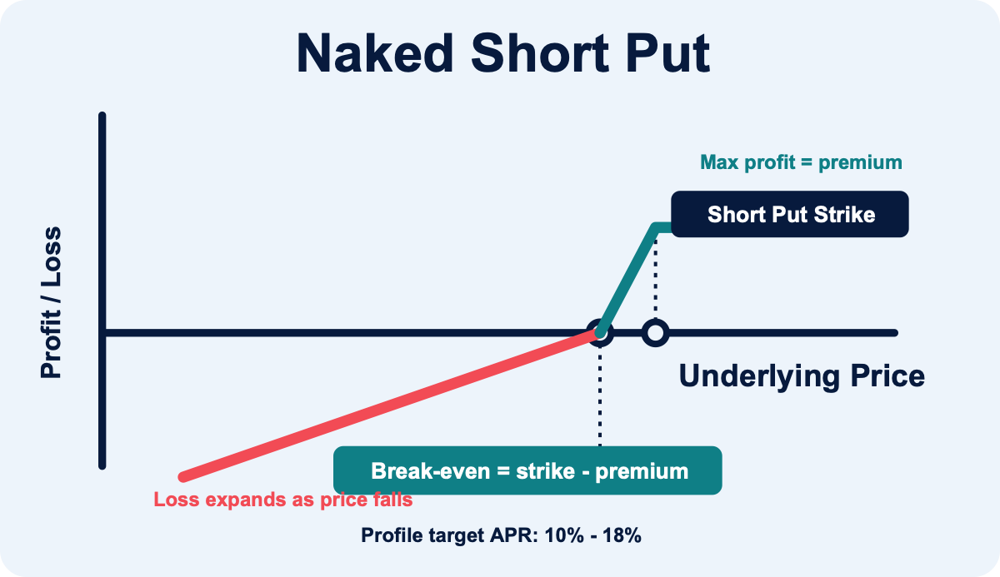
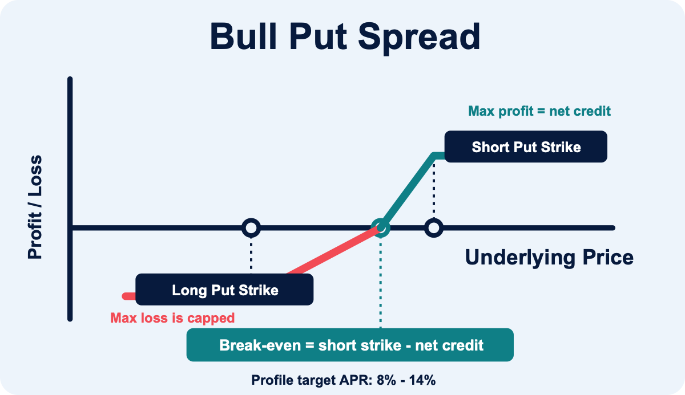
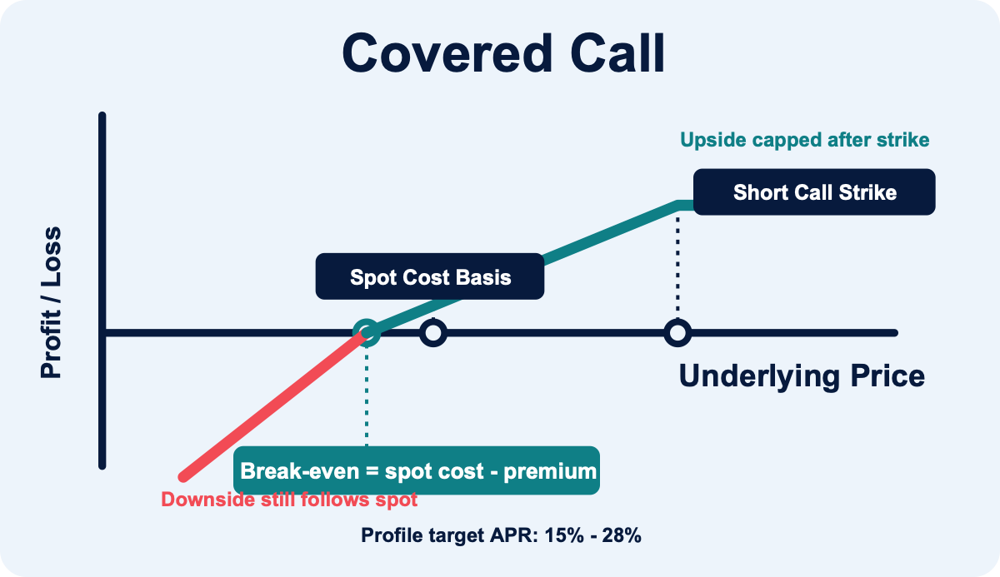

# Deribit Options Strategy Engine

這個 repo 是 `BTC + ETH` 的 Deribit 自動化 option 策略引擎，可透過 `OPTION_STRATEGY` 選擇策略。

GitHub: https://github.com/DegenYM/deribit-options-strategy-engine

This project is not affiliated with or endorsed by Deribit.

核心設計：

- `naked_short`：單腿 short option，依 `SHORT_OPTION_SIDE` 設定為 `put` / `call` / `both`；`both` 時 put 與 call 候選會用同一組排序鍵一起決定 rank，不另外為 call 預留名額。舊名 `naked_short_put` / `naked_short_call` 會自動正規化成 `naked_short`
- `bull_put_spread`：先買 long put 保護腿，再賣 short put，最大虧損以 spread width 封頂
- `covered_call`：只在既有 BTC/ETH 庫存足夠時賣 call，不自動買底層，也不使用 perp 作 cover；可選擇在 ITM 退場時同步賣 Deribit spot
- 可選擇是否啟用 `perp` delta hedge
- `spot` 不參與正常收益流程，只留給異常庫存處理
- 目標是 `1000 USDC` 參考資金下年化淨利 `200 USDC+`
- 預設 `dry-run first`，只有 `--live` 才會真的下單

## Strategy Model

- 掃描 `Deribit Linear USDC Options` 與 `BTC/ETH-settled reversed options`
- 進場窗口預設為 `10-21 DTE`
- short leg 會先過 delta、OTM、OI、book notional、spread ratio、APR 與 book IM/MM 門檻
- `bull_put_spread` 的 long put 以 `BULL_PUT_LONG_DELTA_MIN/MAX` 選擇，同到期且 strike 低於 short put
- `covered_call` 只使用 BTC/ETH 本位 book 的既有可用庫存作 cover，不會自動買現貨或用 perp 補 cover；spot exit 開關預設關閉
- 只做流動性足夠的 short leg：`OI`、`book notional`、`spread ratio` 都要過門檻
- `MIN_LIQUID_EXPIRIES_REQUIRED` 可控制 DTE 視窗內至少需要幾個可交易 expiry 才允許開倉
- regime 分為 `normal / elevated / crisis`
- `crisis` 不開新倉；`hard stop` 直接平倉；`soft trigger` 優先 roll，不行就平倉；`TP` 與 `time exit` 都會主動退場

### Strategies

- `naked_short`：單腿賣 OTM option，依 `SHORT_OPTION_SIDE` 控制方向：
    - `put`：只掃 short put（等同舊版 `naked_short_put`），下跌尾端風險最大。
    - `call`：只掃 short call，上漲尾端風險最大。
    - `both`：put 與 call 候選會合併到同一個 sort key（APR band → preferred delta/OTM → margin efficiency → spread → ...）一起競爭 `TOP_N` 名額；engine 不會強制保留 call 名額。
    建議使用較低 delta、較深 OTM、較低單腿 IM cap。
- `bull_put_spread`：賣較高 strike put，同時買較低 strike put 作保護腿，最大虧損約為 spread width 減淨權利金。因為虧損被 long put 封頂，short put delta 可比 naked short 稍高，但淨權利金、long leg 流動性與 max-loss APR 要一起檢查。
- `covered_call`：只用既有 BTC/ETH 現貨庫存賣 call；現貨 cover 會降低 upside short call 的爆倉型風險，所以 call delta 可選較大。風險是上漲收益被履約價封頂，以及現金/幣本位結算後仍可能留下 spot exposure；若要鎖定 ITM 退場，可開啟 spot exit，robust 模式會先買回 call、再賣 BTC_USDC / ETH_USDC spot。

### Price / Return Sketches

下列圖表是單位化 payoff 示意，用來快速比較到期價格與收益形狀；實際收益仍以 `scan` / `enter-best` 的成交 credit、debit、fee、slippage 與持倉天數為準。

`naked_short`（短 put 範例）：假設 short put strike `K=100`、收到權利金 `P=2`。價格高於 `K` 時收益封頂為權利金，跌破損益兩平點後虧損跟著標的下跌擴大。short call 形狀對稱，只是價格上漲超過 `K` 後虧損擴大。



`bull_put_spread`：假設 short put `K=100`、long put `L=90`、淨 credit `P=2`。上方收益同樣封頂，但下跌最大虧損被 long put 限制。



`covered_call`：假設持有現貨成本 `S0=100`、short call strike `K=110`、收到權利金 `P=2`。權利金提供一點下跌緩衝，但上漲超過 `K` 後總收益被封頂。



## Setup

```bash
cd deribit-options-strategy-engine
python3.11 -m venv .venv   # Python 3.11+ required (uses datetime.UTC)
source .venv/bin/activate
pip install -r requirements-dev.txt
cp .env.example .env
```

開發時跑測試與 lint：

```bash
pytest tests/ -q
ruff check deribit_demo tests scripts
ruff format --check deribit_demo tests scripts
```

僅部署 bot / frontend 時可只裝 `pip install -r requirements.txt`。

## Environment

至少要設定：

- `DERIBIT_ENV=testnet` 或 `mainnet`
- `DERIBIT_CLIENT_ID`
- `DERIBIT_CLIENT_SECRET`
- `ENABLE_PERP_HEDGE=false` 可停用 perpetual hedge；目前預設即為關閉
- `OPTION_STRATEGY` 選擇 `naked_short`、`bull_put_spread` 或 `covered_call`（舊名 `naked_short_put` / `naked_short_call` 會被解析為 `naked_short`）
- 其餘共用參數可直接從 [`.env.example`](.env.example) 複製。
- **建議**：一位投資人一個目錄、底下最多數個子帳戶（各跑不同策略），見 [`config/investors/_example/`](config/investors/_example/)。
- **投資人前置作業**（入金、子帳、API Key、Zero Trust Email）：[`docs/investor-onboarding-zh-TW.md`](docs/investor-onboarding-zh-TW.md)。
- **管理方新增投資人**（CLI：`investor init` / `import-handoff` / `validate`；registry 與 `accounts.toml` 分離）：[`docs/operator-onboarding-zh-TW.md`](docs/operator-onboarding-zh-TW.md)。
- **目錄架構與 legacy 遷移**：[`docs/repo-layout-zh-TW.md`](docs/repo-layout-zh-TW.md)。
- **維護與優化路線圖**（CI、營運、架構拆分）：[`docs/optimization-plan-zh-TW.md`](docs/optimization-plan-zh-TW.md)。
- 策略 tuning 在 [`config/shared/strategies/`](config/shared/strategies/)；子帳至少放憑證與資金規模，有需要時也可在同一檔覆寫少數策略鍵（見下方載入順序）。

### Investor / Sub-account Layout（建議）

```text
config/shared/defaults.env              # 可選：全投資人共用 fallback
config/shared/strategies/.env.<strategy>  # 策略參數（無 API key）
config/investors/<investor_id>/
  accounts.toml                         # 策略子帳清單（通常 ≤ 3；不含 fee）
  accounts/.env.<slug>                  # 策略子帳：憑證、STATE_FILE、資金規模
  accounts/.env.fee                       # 費用專戶（ACCOUNT_ROLE=fee；不在 accounts.toml）

# 同 repo 多投資人時，執行期資料依 investor_id 分目錄（互不干擾）：
.state/investors/<investor_id>/<slug>.json
.state/investors/<investor_id>/<slug>.trade_journal.db
data/frontend_ledger/<investor_id>/[<slug>/]equity_*.jsonl
data/frontend_ledger/<investor_id>/metrics.db
logs/live/<investor_id>/<slug>.log
```

設定載入順序（低 → 高；**子帳 env 最後**，可覆蓋 shared 策略檔）：

1. `config/shared/defaults.env`（可選）
2. `config/investors/<id>/.env.investor`（可選）
3. `config/shared/strategies/.env.<OPTION_STRATEGY>`（或相容的 legacy 路徑）
4. `accounts/.env.<slug>`（策略子帳）

**Fee 專戶**（`accounts/.env.fee`）只載入 defaults + `.env.investor` + 自身 env，**不**合併策略 profile；亦**不在** `accounts.toml`，因此不會被 live 監督或 frontend 聚合。誤用 `./bot run --env-file .../.env.fee` 會被 CLI 拒絕。

若使用 repo 根目錄單一 `.env`（非 `config/investors/.../accounts/`），則仍為：defaults → 該 `.env` → 策略 profile（profile 優先於重疊鍵）。

子帳 `.env.<slug>` 建議至少保留：

`DERIBIT_*`、`OPTION_STRATEGY`、`ORDER_LABEL_PREFIX`、`STATE_FILE`、`REFERENCE_CAPITAL_USDC`、`TARGET_PORTFOLIO_APR`、`TOP_N`

共用參數（delta、風控、流動性門檻等）預設放在策略 profile 或 `defaults.env`；某子帳若要偏離預設，在該子帳的 `accounts/.env.<slug>` 寫入同名鍵即可覆蓋。

建立本機投資人目錄：

```bash
cp -R config/investors/_example config/investors/youming
# 依 accounts/.env.<slug>.example 建立 .env.naked 等並填入 API key
```

更完整的指令整理見下文 **「常用指令」** 一節。

### 同 repo 多投資人（frontend / live 隔離）

- **策略狀態**：`STATE_FILE` 建議設為 `.state/investors/<investor_id>/<slug>.json`（範本已採此格式）。
- **Dashboard**：`./bot --investor <id> frontend` 會自動寫入 `data/frontend_ledger/<investor_id>/`；多子帳時再分子目錄 `<slug>/`。`metrics.db` 為 `data/frontend_ledger/<investor_id>/metrics.db`。
- **Live 監督**：`python scripts/run_live_profiles.py --investor <id> --restart-failed` 只跑 `accounts.toml` 內 **`enabled = true` 且 `live_enabled = true`**（預設 true）且有 API 的子帳；日誌在 `logs/live/<investor_id>/<slug>.log`。若要 dashboard 繼續追蹤某策略但不自動下單，在該列設 `live_enabled = false`（仍須 `enabled = true`）。429 等暫時性 API 錯誤 bot 會退避重試，子程序異常退出時監督腳本會自動重啟該 profile。macOS 常駐範本（jack / youming / an）：[`docs/live-profiles-launchd-zh-TW.md`](docs/live-profiles-launchd-zh-TW.md)。
- **不可混用**：同一個 `frontend` 行程不要同時載入兩位投資人的 env；請各開一個 `--port`（對外 Tunnel 亦一人一路）。
- **覆寫路徑**（進階）：`FRONTEND_LEDGER_DIR`、`FRONTEND_METRICS_DB`；live 則用 `--log-dir`。
- **從舊版 flat ledger 遷移**（曾寫入 `data/frontend_ledger/naked/` 等）：搬到 `data/frontend_ledger/<investor_id>/naked/`，`metrics.db` 搬到 `data/frontend_ledger/<investor_id>/metrics.db`。可執行 `./scripts/cleanup_legacy_layout.sh` 自動清理本機 legacy 產物（詳見 [`docs/repo-layout-zh-TW.md`](docs/repo-layout-zh-TW.md)）。

### 績效費 NAV 快照（Performance fee）

計費口徑見 [`docs/investor-fee-disclosure-zh-TW.md`](docs/investor-fee-disclosure-zh-TW.md)：`NAV_perf`（扣備兌現貨）、`AUM_mgmt`（含現貨）、HWM、10% 績效費。收取方式：投資人季末將帳單金額劃轉至獨立 **Fee 子帳**，管理方以該專戶 API（Wallet 讀寫）收取；策略子帳 API 不開 Wallet（見 [`docs/investor-onboarding-zh-TW.md`](docs/investor-onboarding-zh-TW.md) 第六節）。

1. 在 `config/investors/<id>/.env.investor` 設定備兌現貨數量與費率（範本：[`config/investors/_example/.env.investor.example`](config/investors/_example/.env.investor.example)）。
2. **首次** `./bot --investor <id> fee-snapshot` 會從 **accounts.toml 內所有已設 API 的子帳**加總 `deposit` + `withdrawal` + `transfer`（BTC/ETH/USDC 各帳本，再換算 USDC）。**子帳互轉**在加總時會互相抵銷；**主帳入金再轉入子帳**時，即使沒有主帳 API，也會算在子帳的 inbound `transfer` 上。若首次結果有誤可 `./bot --investor <id> fee-flow-report` 核對，再以 `--force-bootstrap` 重跑。

```
初始 HWM（NAV_perf）= max(0, 累計淨入金 USDC 等價 − 備兌現貨 USDC 等價)
```

若需手動指定起始高水位，可設 `INITIAL_HWM_NAV_PERF`。交易流水預設自 **2026-01-01 UTC** 起掃描（覆寫：`FEE_FLOW_START_DATE=YYYY-MM-DD`）。備兌現貨可選填 `COLLATERAL_SPOT_BTC` / `COLLATERAL_SPOT_ETH`（多數投資人留 0 即可）。
3. 手動或排程快照，寫入 `data/fee_ledger/<investor_id>/snapshots.db`：

```bash
./bot --investor an fee-snapshot          # 立即快照
./bot --investor an fee-status            # 查看 HWM / 最近快照 / 歷史結算
./bot --investor an fee-settle --period 2026-Q1 --net-flow-usdc 0

# 自訂區間結算 + 報表（PDF/MD/CSV）；淨申赎預設自 Deribit 流水計算
./bot --investor an fee-settle-period --from 2026-05-01 --to 2026-05-21
./bot --investor an fee-settle-period --to now                    # --to 之前最近一筆快照 → 現在
./bot --investor an fee-settle-period --to 2026-05-21 --no-persist  # 試算，不寫入 HWM
./bot --investor an fee-report --kind settlement --period 20260501T000000Z_20260521T235959Z

# English reports for investors (PDF + Markdown; PDF is the primary deliverable)
./bot --investor an fee-report --kind initial
./bot --investor an fee-report --kind settlement --period 2026-Q1
./bot --investor an fee-report --kind initial --format pdf    # PDF only
./bot --investor an fee-report --kind initial --format csv   # Excel-friendly CSV only
./bot --investor an fee-report --kind initial --format all    # PDF + MD + CSV

# cron（建議每日 23:55 UTC，季末再 fee-settle）
python3 scripts/snapshot_investor_fee_nav.py --investor an
```

- **Initial report**: auto-written on first `fee-snapshot` bootstrap to `data/fee_ledger/<id>/reports/initial/initial-YYYYMMDD.{pdf,md,-flows.csv,-summary.csv}`.
- **Quarterly report**: auto-written after `fee-settle` to `data/fee_ledger/<id>/reports/YYYY-MM-DD/settlement-YYYY-QN.{pdf,md,-flows.csv,-summary.csv}` (date folder = period end, UTC).
- **Period settlement** (`fee-settle-period`): same date layout under `reports/YYYY-MM-DD/settlement-<period-id>.*`.
- **CSV**: `-summary.csv` = Day A/B balances, deposits, withdrawals, earned, fees; `-flows.csv` = period cash movements; `-trades.csv` = closed option groups in the period.

快照會合併該投資人所有 enabled 子帳（同 API key 去重），並依 Deribit 指數價計算 `NAV_perf = 總權益 − 備兌現貨 USDC 等價`。


策略專屬參數請改 [`config/shared/strategies/`](config/shared/strategies/)。

以下參數以 `REFERENCE_CAPITAL_USDC=1000` 的小資金試跑為基準，預設偏保守。實際上線前先用 `testnet` 與 dry-run 觀察 `scan --json` 的候選數量、rejection reason 與成交價差；若候選太少，優先放寬 `MIN_LIQUID_EXPIRIES_REQUIRED`、流動性門檻或 DTE，不要先大幅提高 delta。

`.env` 建議只放環境、憑證與所有策略共用的基礎參數：

```dotenv
# --- Environment & credentials ---
DERIBIT_ENV=testnet
DERIBIT_CLIENT_ID=
DERIBIT_CLIENT_SECRET=

# --- Portfolio scope ---
MANAGED_CURRENCIES=BTC,ETH
SCAN_UNDERLYINGS=BTC,ETH
MIN_BOOK_EQUITY_USDC=50
REFERENCE_CAPITAL_USDC=1000
TARGET_PORTFOLIO_APR=0.25
TOP_N=5

# --- Entry window ---
PUT_DTE_MIN=10
PUT_DTE_MAX=21
MIN_LIQUID_EXPIRIES_REQUIRED=2

# --- Liquidity gates ---
INVERSE_MIN_OPEN_INTEREST=20
# Optional per-underlying overrides; BTC_MIN_OPEN_INTEREST / ETH_MIN_OPEN_INTEREST
# apply to both inverse and linear unless the type-specific key is set.
# BTC_MIN_OPEN_INTEREST=20
# ETH_MIN_OPEN_INTEREST=12
# BTC_INVERSE_MIN_OPEN_INTEREST=20
# ETH_INVERSE_MIN_OPEN_INTEREST=12
INVERSE_MAX_SPREAD_RATIO=0.12
INVERSE_MIN_BOOK_NOTIONAL_USDC=3000
LINEAR_MIN_OPEN_INTEREST=8
# BTC_LINEAR_MIN_OPEN_INTEREST=8
# ETH_LINEAR_MIN_OPEN_INTEREST=5
LINEAR_MAX_SPREAD_RATIO=0.14
LINEAR_MIN_BOOK_NOTIONAL_USDC=4000

# --- APR gates ---
# APR = round-trip net premium per contract / that leg's collateral notional, annualized.
# Inverse: (bid - entry_fee - exit_fee) / contract_size / DTE * 365 (typically contract_size = 1 BTC/ETH).
# USDC put: net premium / strike; USDC call: net premium / index.
MIN_NET_APR=0.08
TARGET_NET_APR_MIN=0.10
TARGET_NET_APR_MAX=0.18

# --- Book risk caps ---
PER_LEG_IM_CAP_PUT=0.15
PER_LEG_IM_CAP_CALL=0.12
EXPIRY_IM_CAP=0.30
BOOK_IM_TARGET=0.35
BOOK_IM_HARD=0.45
BOOK_MM_TARGET=0.22
BOOK_MM_HARD=0.33
# OPEN_MAX_LOSS_HALT_RATIO 省略時預設等於 BOOK_IM_HARD（見 config.py）。

# --- Position management ---
TP_CAPTURE_PCT=0.55
ENABLE_EARLY_EXIT=true
EARLY_EXIT_REMAINING_APR=0.08
EARLY_EXIT_MIN_PROFIT_CAPTURE=0.45
EARLY_EXIT_MAX_SPREAD_RATIO=0.06
TIME_EXIT_DTE=4
SOFT_DEFENSE_LOSS_PCT=0.30
HARD_STOP_LOSS_PCT=0.45

# --- Regime / circuit breakers ---
INDEX_DRAWDOWN_ELEVATED_PCT=0.035
INDEX_DRAWDOWN_CRISIS_PCT=0.055
DVOL_ELEVATED_MULTIPLIER=1.20
DVOL_CRISIS_MULTIPLIER=1.50
HALT_DRAWDOWN_PCT=0.025
HARD_DERISK_DRAWDOWN_PCT=0.06
HARD_DERISK_MAINTENANCE_MARGIN_RATIO=0.33
HARD_DERISK_ON_CRISIS_OPEN_GROUP=false

# --- Hedging / pacing ---
ENABLE_PERP_HEDGE=false
MAX_CONCURRENT_GROUPS=6
MAX_GROUPS_PER_CURRENCY=3
ENTRY_COOLDOWN_MINUTES=20
COOLDOWN_HOURS=12
RECOVERY_NORMAL_CYCLES=3
ENABLE_NAKED_TOPUP=false
ENABLE_ADOPT_EXCHANGE_POSITIONS=true

# --- Execution / state ---
OPTION_FEE_RATE=0.0003
OPTION_FEE_CAP_RATE=0.125
EXIT_BUFFER_RATIO=0.03
SHORT_ENTRY_WAIT_SECONDS=120
ORDER_POLL_SECONDS=10
POLL_SECONDS_NORMAL=15
POLL_SECONDS_STRESS=5
ORDER_LABEL_PREFIX=naked_short
REQUEST_TIMEOUT_SECONDS=20
STATE_FILE=.state/naked_short.json
```

策略專屬值請放在對應 profile 檔；切換策略時改 account env 的 `OPTION_STRATEGY`，並同步使用該策略自己的 `STATE_FILE`。

建議的 state 分流：

```text
covered_call:     STATE_FILE=.state/covered_call.json      ORDER_LABEL_PREFIX=covered_call
naked_short:      STATE_FILE=.state/naked_short.json       ORDER_LABEL_PREFIX=naked_short
bull_put_spread:  STATE_FILE=.state/bull_put_spread.json   ORDER_LABEL_PREFIX=bull_put_spread
```

下列三組策略參數在 `config/shared/strategies/`（`.env.naked_short`、`.env.bull_put_spread`、`.env.covered_call`）。

`naked_short`：尾端風險最大，但收益性排在 covered call 之後、bull put spread 之前。`SHORT_OPTION_SIDE` 可選 `put` / `call` / `both`：選 `both` 時 put 與 call 候選會用同一個 sort key 一起排序、競爭 `TOP_N` 名額。

```dotenv
OPTION_STRATEGY=naked_short
OPTION_MARKETS_PROFILE=all
TRADED_COLLATERALS=BTC,ETH,USDC
SHORT_OPTION_SIDE=both

SHORT_PUT_DELTA_MIN=0.08
SHORT_PUT_DELTA_MAX=0.14
PREFERRED_SHORT_PUT_DELTA_MIN=0.09
PREFERRED_SHORT_PUT_DELTA_MAX=0.12
PUT_OTM_MIN=0.09
PUT_OTM_MAX=0.24

BTC_PUT_DELTA_MIN=0.08
BTC_PUT_DELTA_MAX=0.15
BTC_PREFERRED_PUT_DELTA_MIN=0.09
BTC_PREFERRED_PUT_DELTA_MAX=0.12
BTC_PUT_OTM_MIN=0.08
BTC_PUT_OTM_MAX=0.22
BTC_PREFERRED_OTM_MIN=0.10
BTC_PREFERRED_OTM_MAX=0.16

ETH_PUT_DELTA_MIN=0.07
ETH_PUT_DELTA_MAX=0.13
ETH_PREFERRED_PUT_DELTA_MIN=0.08
ETH_PREFERRED_PUT_DELTA_MAX=0.11
ETH_PUT_OTM_MIN=0.10
ETH_PUT_OTM_MAX=0.24
ETH_PREFERRED_OTM_MIN=0.12
ETH_PREFERRED_OTM_MAX=0.18

MIN_NET_APR=0.08
TARGET_NET_APR_MIN=0.10
TARGET_NET_APR_MAX=0.18
PER_LEG_IM_CAP_PUT=0.14
BOOK_IM_TARGET=0.30
BOOK_IM_HARD=0.40
SOFT_DEFENSE_DELTA=0.18
HARD_DEFENSE_DELTA=0.25
SOFT_DEFENSE_LOSS_PCT=0.25
HARD_STOP_LOSS_PCT=0.40
```

`bull_put_spread`：有 long put 保護腿，但雙腿 debit 會犧牲淨 credit，所以 APR 門檻最低。

```dotenv
OPTION_STRATEGY=bull_put_spread
OPTION_MARKETS_PROFILE=all
TRADED_COLLATERALS=BTC,ETH,USDC
SHORT_OPTION_SIDE=put

SHORT_PUT_DELTA_MIN=0.08
SHORT_PUT_DELTA_MAX=0.16
PREFERRED_SHORT_PUT_DELTA_MIN=0.09
PREFERRED_SHORT_PUT_DELTA_MAX=0.13
PUT_OTM_MIN=0.08
PUT_OTM_MAX=0.23

BTC_PUT_DELTA_MIN=0.09
BTC_PUT_DELTA_MAX=0.17
BTC_PREFERRED_PUT_DELTA_MIN=0.10
BTC_PREFERRED_PUT_DELTA_MAX=0.14
BTC_PUT_OTM_MIN=0.07
BTC_PUT_OTM_MAX=0.21
BTC_PREFERRED_OTM_MIN=0.09
BTC_PREFERRED_OTM_MAX=0.15

ETH_PUT_DELTA_MIN=0.07
ETH_PUT_DELTA_MAX=0.14
ETH_PREFERRED_PUT_DELTA_MIN=0.08
ETH_PREFERRED_PUT_DELTA_MAX=0.12
ETH_PUT_OTM_MIN=0.10
ETH_PUT_OTM_MAX=0.23
ETH_PREFERRED_OTM_MIN=0.12
ETH_PREFERRED_OTM_MAX=0.17

BULL_PUT_LONG_DELTA_MIN=0.025
BULL_PUT_LONG_DELTA_MAX=0.07
MIN_NET_APR=0.06
TARGET_NET_APR_MIN=0.08
TARGET_NET_APR_MAX=0.14
PER_LEG_IM_CAP_PUT=0.16
BOOK_IM_TARGET=0.35
BOOK_IM_HARD=0.45
SOFT_DEFENSE_DELTA=0.22
HARD_DEFENSE_DELTA=0.32
```

`covered_call`：只使用既有 BTC/ETH 現貨 cover，建議只開 inverse native book；這是最積極的收益 profile。

```dotenv
OPTION_STRATEGY=covered_call
OPTION_MARKETS_PROFILE=inverse_native
TRADED_COLLATERALS=BTC,ETH
SHORT_OPTION_SIDE=call
MIN_NET_APR=0.12
TARGET_NET_APR_MIN=0.15
TARGET_NET_APR_MAX=0.28

SHORT_CALL_DELTA_MIN=0.18
SHORT_CALL_DELTA_MAX=0.38
PREFERRED_SHORT_CALL_DELTA_MIN=0.22
PREFERRED_SHORT_CALL_DELTA_MAX=0.32
CALL_OTM_MIN=0.025
CALL_OTM_MAX=0.18

BTC_CALL_DELTA_MIN=0.18
BTC_CALL_DELTA_MAX=0.38
BTC_PREFERRED_CALL_DELTA_MIN=0.22
BTC_PREFERRED_CALL_DELTA_MAX=0.32
BTC_CALL_OTM_MIN=0.025
BTC_CALL_OTM_MAX=0.16
BTC_PREFERRED_CALL_OTM_MIN=0.04
BTC_PREFERRED_CALL_OTM_MAX=0.10

ETH_CALL_DELTA_MIN=0.16
ETH_CALL_DELTA_MAX=0.34
ETH_PREFERRED_CALL_DELTA_MIN=0.20
ETH_PREFERRED_CALL_DELTA_MAX=0.30
ETH_CALL_OTM_MIN=0.035
ETH_CALL_OTM_MAX=0.20
ETH_PREFERRED_CALL_OTM_MIN=0.05
ETH_PREFERRED_CALL_OTM_MAX=0.12

SOFT_DEFENSE_DELTA_CALL=0.35
HARD_DEFENSE_DELTA_CALL=0.50
PER_LEG_IM_CAP_CALL=0.20

# Optional ITM spot exit; disabled by default.
COVERED_CALL_SPOT_EXIT_ENABLED=false
COVERED_CALL_ROBUST_EXIT_ENABLED=false
COVERED_CALL_ROBUST_EXIT_DTE=0.5
COVERED_CALL_ITM_BUFFER_PCT=0
COVERED_CALL_SPOT_ORDER_TYPE=market

MAX_GROUPS_PER_CURRENCY=3
MAX_CONCURRENT_GROUPS=6
```

注意：

- `ping` 可以不帶私有憑證
- `status`、`enter-best --live`、`manage --live`、`run --live`、`panic-close --live`、`close-position --live`、`cancel` 需要私有憑證
- Deribit 衍生品交易是否可用，取決於你的帳戶資格與司法管轄限制

## 常用指令

### 怎麼指定用哪個子帳

| 方式 | 範例 |
|------|------|
| **投資人 + slug**（建議） | `./bot --investor youming --account naked <子命令>`；slug 見 `config/investors/<id>/accounts.toml` |
| **直接 env 路徑** | `./bot --env-file config/investors/youming/accounts/.env.naked <子命令>`（路徑可寫在子命令前或後） |
| **舊版單一 `.env`** | 不帶 `--investor`，預設讀 repo 根目錄 `.env` |

`--investor` 與一般子命令並用時，**多數子命令必須加 `--account <slug>`**（`frontend` 例外：不帶 `--account` 時會聚合該投資人 `accounts.toml` 內所有 `enabled` 子帳）。

- 預設 **dry-run**；要真的下單須加 `--live`（`enter-best`、`manage`、`run`、`panic-close`、`close-position`）。
- 除 `ping` 外，需要連線與私有金鑰；實單前先在 `testnet` 或 dry-run 確認輸出。

### 投資人子帳（youming 範例）

```bash
# 連線 / 部位 / 掃描 / 一輪管理（dry-run）
./bot --investor youming --account naked ping --json
./bot --investor youming --account naked status --json
./bot --investor youming --account naked scan --currencies BTC,ETH --json
./bot --investor youming --account naked manage --json

# 下單與持續迴圈（--live 才實單）
./bot --investor youming --account naked enter-best --currencies BTC,ETH --json
./bot --investor youming --account naked enter-best --currencies BTC,ETH --live --json
./bot --investor youming --account naked manage --live --json
./bot --investor youming --account naked run --cycles 1 --json
./bot --investor youming --account naked run --cycles 0 --live

# 報表、壓力測試、成交查詢（依子帳 API）
./bot --investor youming --account naked report --days 30 --json
./bot --investor youming --account naked stress-current --json
./bot --investor youming --account naked user-trades --currency USDC --count 50 --json

# 緊急全平（取消掛單 + 平倉；--live 才送單）
./bot --investor youming --account naked panic-close --json
./bot --investor youming --account naked panic-close --live --json

# 依 order id 取消單筆掛單
./bot --investor youming --account naked cancel --order-id YOUR_ORDER_ID --json
```

### 儀表板與多子帳 live

```bash
# 本地 dashboard（預設 http://127.0.0.1:8765 ）
./bot --investor youming frontend
./bot --investor youming frontend --port 9000
./bot frontend --account-env-files config/investors/youming/accounts/.env.naked,config/investors/youming/accounts/.env.bull_put

# 同時啟動 accounts.toml 內 live_enabled 子帳的 `run --live`（log：logs/live/<investor_id>/<slug>.log）
python scripts/run_live_profiles.py --investor youming --restart-failed
python scripts/run_live_profiles.py --investor alice --restart-failed

# 不經 --investor，改用手動列出多個子帳 env：
python scripts/run_live_profiles.py \
  config/investors/youming/accounts/.env.naked \
  config/investors/youming/accounts/.env.bull_put
```

### 單一 `.env`（未用 `config/investors/...` 時）

```bash
./bot ping
./bot scan --currencies BTC,ETH --json
./bot scan --strategy covered_call --currencies BTC,ETH --json
./bot enter-best --currencies BTC --json
./bot enter-best --currencies BTC --live --json
./bot manage --json
./bot manage --live --json
./bot run --cycles 1 --json
./bot run --cycles 0 --live
./bot panic-close --json
./bot panic-close --live --json
./bot status --json
./bot report --days 30 --json
./bot cancel --order-id YOUR_ORDER_ID --json
```

（也可用為除錯路徑單獨指定：`./bot --env-file ./.env scan --json`。）

`scan --strategy` 可在不修改 `.env` 的情況下覆蓋本次掃描策略，並會套用同目錄對應的 `.env.<strategy>` profile。可用值為 `naked_short`、`bull_put_spread`、`covered_call`（舊名 `naked_short_put` / `naked_short_call` 仍會被接受並對應到 `naked_short`）。

### `close-position`（子帳精準平倉）

關閉**指定合約**的交易所倉位，適合手動殘倉、單腿調整或只平某一張期權／永續。與 `panic-close` 不同：不會取消全部掛單、不平掉其他 group、不寫入 portfolio cooldown。

**請用子帳 env**（API key 已限定該子帳），例如 `config/investors/youming/accounts/.env.naked`，或 `./bot --investor youming --account naked`。

| 參數 | 說明 |
|------|------|
| `--env-file PATH` | 子帳憑證與 `STATE_FILE`（可寫在子命令前或後） |
| `--list` | 只列出非零倉位（dry-run，不需 `--instrument`） |
| `--instrument NAME` | 要平的合約全名；可重複傳入或逗號分隔多個 |
| `--live` | 實際送單；省略則僅預覽 |
| `--order-type market\|limit` | 預設 `market`；選擇權 `limit` 走 IOC limit + retry（同 `manage` 平倉） |
| `--amount QTY` | 部分平倉張數；省略則平掉該合約全部倉位 |
| `--json` | JSON 輸出 |

平倉方式（依合約類型）：

- **選擇權**：`market` → reduce-only 市價單；`limit` → reduce-only IOC limit（含 retry）
- **永續／期貨**：`private/close_position`（市價）

```bash
# 1) 先看子帳有哪些倉位
./bot --investor youming --account naked status --json
./bot --investor youming --account naked close-position --list --json

# 2) 預覽平某一張（不送單）
./bot --investor youming --account naked close-position \
  --instrument BTC_USDC-27MAR26-90000-P --json

# 3) 市價全平該合約
./bot --investor youming --account naked close-position \
  --instrument BTC_USDC-27MAR26-90000-P --live --json

# 4) 選擇權用 limit 平倉
./bot --investor youming --account bull_put close-position \
  --instrument BTC_USDC-27MAR26-88000-P --order-type limit --live --json
```

**與 `panic-close` 對照**

| | `close-position` | `panic-close` |
|--|------------------|---------------|
| 範圍 | 僅 `--instrument` 指定合約 | 全部 open group + PERP |
| 掛單 | 不取消 | 取消所有 open orders |
| Cooldown | 不設定 | 寫入全 book cooldown |
| 本地 state | 不自動更新 group | 標記 group 為 closed |

手動平掉 bot 有追蹤的 spread 後，本地 `STATE_FILE` 可能與交易所不一致；之後可再跑 `manage` 讓 reconcile 收斂，或等 Phase 2 的 `--group-id` / `--sync-state`。

（一次啟動多子帳 `run --live`：`python scripts/run_live_profiles.py`，詳見上方 **常用指令 → 儀表板與多子帳 live**。）

## Design Notes

- 認證為了試用簡化，HTTP private request 直接走 Basic Auth
- 掃描同時支援 `quote_currency=settlement_currency=USDC` 的線性 options，以及 `quote_currency=settlement_currency=BTC/ETH` 的 reversed options
- `portfolio APR` 用 `annualized net pnl / REFERENCE_CAPITAL_USDC`
- 已平倉表的 **`Annualized`**：`(realized_pnl / 該筆倉位抵押名目) × (365 / holding days)`。covered call / 逆線 naked 分母通常為 `quantity`（1 BTC/ETH 每張）；USDC put 為 `strike × quantity`；bull put spread 為 `estimated_im_collateral`（max loss）。`realized_pnl` 仍為 USDC 等價；BTC／ETH 本位優先用 `realized_pnl_collateral_native`
- **`Return / max-loss`** 仍為 `realized_pnl / max_loss`（與上列年化分母口徑不同時，兩欄數字不必一致）
- 所有 `credit / debit / max loss / report` 內部都統一換算成 `USDC equivalent`
- 本地狀態保存在 `STATE_FILE`；多子帳建議使用 `.state/investors/<id>/<slug>.json`
- `report` 讀本地 state 中已關閉 spread 的 realized 資料；若啟用 perp hedge，報表仍只統計 spread PnL，不含 perp hedge PnL
- `run` 會先做 `manage`，再在條件允許時嘗試 `enter-best`

## Local Dashboard

`./bot frontend` 會啟一個本地 FastAPI server + 純 HTML 單頁前端，把 `status` /
`report` / `stress-current` / `STATE_FILE` 整合成一頁式 dashboard，
明確區分 **BTC / ETH / USDC** 三本位帳戶（由 `PortfolioSnapshot` 內建分桶），顯示：

- 三張 book card：USDC-equivalent equity、原幣 equity、day P&L、IM/MM ratio、delta、regime
- 投組總覽 USDC card：total equity、total profit（lifetime + 30d window）、lifetime/window APR、win rate、avg holding days
- 圖表：open max loss vs book equity（USDC）、累積 realized PnL、每日 PnL + 30d MA、rolling APR
- Open spreads 表 / Recent closed trades 表
- 黑天鵝壓力測試卡（同 `./bot stress-current`，會依 `OPTION_STRATEGY` 顯示 `naked_short` / `bull_put_spread` / `covered_call` 的風險解讀）

啟動：

```bash
pip install -r requirements.txt
./bot frontend                       # 預設 http://127.0.0.1:8765
./bot frontend --port 9000           # 換埠
./bot frontend --no-scheduler        # 關掉背景 equity ledger
./bot --investor youming frontend
```

預設背景 scheduler 每 `FRONTEND_SNAPSHOT_INTERVAL_SEC` 秒（預設 300）讀一次帳戶
快照，append 到 `data/frontend_ledger/<investor_id>/`（多子帳時為 `.../<investor_id>/<slug>/equity_<UTC date>.jsonl`）。
沒設 `DERIBIT_CLIENT_ID/SECRET` 時 scheduler 自動跳過，但 server
依然可看 closed groups / 累積 PnL / APR 圖。
前端頁面資料刷新有 3 分鐘節流上限；自動刷新與手動 `Refresh` 都會套用同一個限制。

多子帳 dashboard 建議 `./bot --investor <id> frontend`，或 `--account-env-files` 傳入**同一位**投資人的多個 `accounts/.env.<slug>`。

**多名投資人**（各 `config/investors/<id>/` 一份資料）若需各自專屬對外網址：請為每位投資人各跑一個 `frontend`（例如不同 `--port`），再以 reverse proxy／Tunnel 將不同子網域指到對應埠；細節見 [docs/cloudflare-tunnel-investor.md](docs/cloudflare-tunnel-investor.md)。

**macOS 一鍵啟停全部 dashboard（launchd）**：`./bot investor frontend start|stop|restart|status`（依 `config/platform/registry.toml` 的 `frontend_enabled`）；包裝腳本 `./scripts/frontend_launchd_all.sh start`。

**macOS 一鍵啟停全部 live bot（launchd）**：`./bot investor live start|stop|restart|status`（依 `live_enabled`）；包裝腳本 `./scripts/live_launchd_all.sh start`。細節見 [`docs/live-profiles-launchd-zh-TW.md`](docs/live-profiles-launchd-zh-TW.md)。

家用或無固定公網 IP 時，若要對投資人提供固定 **HTTPS** 連結，可使用 **Cloudflare Named Tunnel**（本機維持 `127.0.0.1` 即可）：步驟、 `config.yml` 範例、launchd 與 Access 建議見同一份文件。

## Tests

```bash
pytest
```
