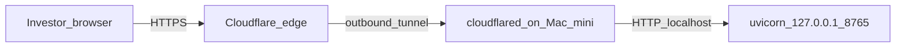

# 以 Cloudflare Tunnel 對外開放投資人儀表板（Mac mini）

本專案 dashboard 由本機 FastAPI（uvicorn）提供，預設只綁 `**127.0.0.1:8765**`。使用 **Cloudflare Named Tunnel** 可在**不需家用公網 IP、不需路由器開 443** 的前提下，對外提供固定 HTTPS；投資人頁面為：

- `[/investor.html](../frontend/investor.html)`（英文摘要，**預設**）
- `[/investor.zh.html](../frontend/investor.zh.html)`（繁中摘要）

API 為同源 `**/api/...`**。**一位投資人一個 dashboard 行程**（見下方「多投資人」）；同一行程內若有多個子帳，仍共用該投資人的同一組 `/api/...`。

## 完整設定流程（從零到有網址）

依序做一次即可；細節與範例見後文各節。


| 步驟                                   | 要做的事                                                                                                                                                                                                 |
| ------------------------------------ | ---------------------------------------------------------------------------------------------------------------------------------------------------------------------------------------------------- |
| **0. 準備**                            | 網域 DNS 在 Cloudflare；Mac mini 可長開（能源／睡眠調整見文末「資安與營運」）。                                                                                                                                                 |
| **1. 投資人資料**                         | 每位投資人一份 `config/investors/<id>/`（由 `[config/investors/_example/](../config/investors/_example/)` 複製）：`accounts.toml` + 各子帳 `accounts/.env.<slug>`（含 Deribit 等設定）。勿把含密鑰檔案提交 git。                      |
| **2. 本機驗證**                          | `cd` 到 repo，`pip install -r requirements.txt`；每位對外投資人各一埠，例如：`./bot --investor alice frontend --port 8765`。瀏覽器開 `http://127.0.0.1:8765/` 或 `http://127.0.0.1:8765/investor.html` 確認有畫面。多一位投資人就多一個終端機、不同 `--port`（8766、8767…）。 |
| **3. 決定網址**                          | **單一投資人**：一個 hostname，例如 `portfolio.example.com` → 本機 `8765`。**多位投資人**：每人一個子網域，例如 `alice.portfolio.example.com` → `8765`、`bob.portfolio.example.com` → `8766`（埠與 hostname 一對一寫在下一步）。                 |
| **4. 安裝 cloudflared**                | `brew install cloudflared`；`which cloudflared` 記下路徑（Apple Silicon 常為 `/opt/homebrew/bin/cloudflared`）。                                                                                               |
| **5. 建立 Named Tunnel**               | `cloudflared tunnel login`（選帳號與網域）→ `cloudflared tunnel create deribit-tunnel`（名稱自訂）。記下 **Tunnel UUID**；憑證約在 `~/.cloudflared/<UUID>.json`，執行 `chmod 600 ~/.cloudflared/*.json`。                    |
| **6. 寫 `~/.cloudflared/config.yml`** | 頂層設 `tunnel:`、`credentials-file:`；`ingress:` 內每個對外 hostname 一列 `service: http://127.0.0.1:<埠>`，**最後一列**必須是 `service: http_status:404`。單人／多人 YAML 範例見「三、設定 config.yml」與「多投資人」小節。                      |
| **7. DNS**                           | 每個 hostname 各綁一次：`cloudflared tunnel route dns deribit-tunnel <hostname>`；或在 Cloudflare DNS 手動 CNAME（以官方文件為準）。                                                                                     |
| **8. 連線測試**                          | **先**啟動所有 `./bot --investor … frontend --port …`，**再**執行 `cloudflared tunnel --config ~/.cloudflared/config.yml run`。瀏覽器開 `https://<hostname>/` 或 `https://<hostname>/investor.html`。                                     |
| **9. Access（強烈建議）**                  | Cloudflare Zero Trust → Access → 新增 **Application**，Domain 填該投資人的 hostname（多人則每人一個 Application、各自允許名單）。未設 Access 前勿廣傳網址。                                                                             |
| **10. 開機常駐**                         | 每位投資人一個 frontend 的 LaunchAgent + **一個** cloudflared 的 LaunchAgent；`launchctl load` 載入。見「六、macOS launchd」。                                                                                            |


完成後，給投資人的書籤範例：`https://alice.portfolio.example.com/` 或 `https://alice.portfolio.example.com/investor.html`（依你的 hostname 替換；`--investor` 啟動時根路徑會導向英文頁）。

## 多投資人：各用專屬網址與資料

每位投資人有自己的目錄 `[config/investors/<id>/](../config/investors/_example/)`（`accounts.toml` + 各子帳 `.env`）。**不要**把多個投資人合併在同一個 `./bot frontend` 裡對外展示，否則權益會混在一起。

推薦做法：

1. **本機**：為每位投資人各啟一個 frontend，**埠號不同**（範例）：
  ```bash
   ./bot --investor alice frontend --port 8765
   ./bot --investor bob  frontend --port 8766
  ```
2. **對外網址**：每位投資人一個 **子網域**（或不同網域），例如 `alice.portfolio.example.com`、`bob.portfolio.example.com`。頁面路徑仍相同：`**/investor.html`** 或 `**/investor.zh.html**`（資料來自該埠背後的那一個 `--investor`）。
3. **Tunnel**：在同一個 `config.yml` 的 `ingress` 裡為每個 hostname 指到對應的本機埠（**順序靠前的規則優先**）：
  ```yaml
   ingress:
     - hostname: alice.portfolio.example.com
       service: http://127.0.0.1:8765
     - hostname: bob.portfolio.example.com
       service: http://127.0.0.1:8766
     - service: http_status:404
  ```
4. **DNS**：對每個子網域各執行一次 `cloudflared tunnel route dns <TUNNEL_NAME> <hostname>`（或在 Cloudflare DNS 手動 CNAME）。
5. **Cloudflare Access**：**建議每位投資人獨立 Access 應用程式**（或獨立允許名單），只放行該投資人的 Email／IdP，避免 A 拿到 B 的網址後仍能開啟頁面。

同一台 Mac mini 上可同時常駐多個 `frontend`（多份 launchd plist，`Label`／`ProgramArguments` 內 `--investor` 與 `--port` 各別設定）+ 一個 `cloudflared run`。

與「單一投資人、多子帳」的差異：多子帳是 **同一個** `accounts.toml` 內多個 `[[accounts]]` 列在同一個 dashboard；多投資人是 **多份** `config/investors/<id>/`、多行程、多個對外 hostname。

## 流量示意




## 為何用 Named Tunnel，而不是 trycloudflare


| 方式                                                                         | 說明                            |
| -------------------------------------------------------------------------- | ----------------------------- |
| `cloudflared tunnel --url http://127.0.0.1:8765` 產生的 `*.trycloudflare.com` | 僅適合**偶爾測試**；URL 常變，不適合給投資人書籤  |
| **Named Tunnel** + 自訂子網域（DNS 在 Cloudflare）                                 | **固定網址**、可搭配 **Access** 控管誰能看 |


## 前置條件

1. 一個網域，且 **DNS 託管在 Cloudflare**（免費方案即可）。
2. Mac mini 上已能本機啟動 dashboard，例如：
  ```bash
   cd /path/to/deribit_option
   ./bot --investor YOUR_INVESTOR_ID frontend
  ```
   確認瀏覽器開 `http://127.0.0.1:8765/` 或 `http://127.0.0.1:8765/investor.html` 有畫面。
3. **建議**：維持 `--host` 預設（`127.0.0.1`），不要為了 Tunnel 改綁 `0.0.0.0`；TLS 由 Cloudflare 終止即可。

## 一、安裝 cloudflared

```bash
brew install cloudflared
```

## 二、建立 Named Tunnel 並授權網域

```bash
cloudflared tunnel login
cloudflared tunnel create deribit-tunnel
```

記下輸出中的 **Tunnel UUID**。憑證檔通常落在 `~/.cloudflared/<UUID>.json`。**不要**把此 JSON 提交進 git（見專案根目錄 `.gitignore`）。

## 三、設定 config.yml（單一投資人範例）

若只有一位投資人對外，在本機建立（或編輯）`~/.cloudflared/config.yml`。以下將 `portfolio.example.com` 全部轉到**單一**本機 dashboard；請替換為你的 **Tunnel UUID** 與 **實際子網域**。多位投資人時請改用上一節的多條 `hostname` / 多埠設定，不要共用同一埠。

```yaml
tunnel: YOUR_TUNNEL_UUID
credentials-file: /Users/YOUR_USER/.cloudflared/YOUR_TUNNEL_UUID.json

ingress:
  - hostname: portfolio.example.com
    service: http://127.0.0.1:8765
  - service: http_status:404
```

- `credentials-file` 路徑需與 `cloudflared tunnel create` 產生的 **JSON 憑證**一致。
- 建議：`chmod 600 ~/.cloudflared/*.json`

## 四、DNS 綁定

（將 `deribit-tunnel`、`portfolio.example.com` 改成你的 tunnel 名稱與 hostname。）

```bash
cloudflared tunnel route dns deribit-tunnel portfolio.example.com
```

或在 Cloudflare DNS 手動新增 CNAME（細節以 [Cloudflare 文件](https://developers.cloudflare.com/cloudflare-one/connections/connect-networks/) 為準）。

## 五、手動驗證

**順序**：先啟動本機 `frontend`，再啟動 tunnel。

```bash
cloudflared tunnel --config ~/.cloudflared/config.yml run
```

另開終端機已跑著 `./bot ... frontend` 後，用瀏覽器開：

`https://portfolio.example.com/` 或 `https://portfolio.example.com/investor.html`

使用 `./bot --investor … frontend` 時，本機已將 `/` **302** 到 `/investor.html`（英文）。**對外給投資人請只分享根網址或 investor 路徑**，並務必搭配下方 **Access**（見資安說明）。內部 ops 全功能頁為 `index.html`，勿對外分享。

### 讓根路徑 `/` 導向投資人頁（可選）

若未用 `--investor` 啟動、或想在 Cloudflare 層統一導向，可用 **Bulk Redirects** 或 **Redirect Rules**，將 `https://portfolio.example.com/` **301** 到 `https://portfolio.example.com/investor.html`（繁中請改為 `investor.zh.html`）。

## 六、macOS launchd 常駐（建議）

同一台 Mac 需長期跑 `**1 + N` 個行程**（`N` = 對外開放的投資人人數）：

1. **Dashboard**：每位投資人一個 `./bot --investor <id> frontend --port <port>`（監聽對應的本機埠）
2. **Tunnel**：**一個** `cloudflared tunnel --config ~/.cloudflared/config.yml run`（ingress 含多個 hostname 時仍只跑這一個行程）

以下為 **LaunchAgent** 範本，路徑請改成你的環境；`Label` 需唯一。

### 6a. cloudflared

存成 `~/Library/LaunchAgents/com.example.cloudflared.deribit-tunnel.plist`：

```xml
<?xml version="1.0" encoding="UTF-8"?>
<!DOCTYPE plist PUBLIC "-//Apple//DTD PLIST 1.0//EN" "http://www.apple.com/DTDs/PropertyList-1.0.dtd">
<plist version="1.0">
<dict>
  <key>Label</key>
  <string>com.example.cloudflared.deribit-tunnel</string>
  <key>ProgramArguments</key>
  <array>
    <string>/opt/homebrew/bin/cloudflared</string>
    <string>tunnel</string>
    <string>--config</string>
    <string>/Users/YOUR_USER/.cloudflared/config.yml</string>
    <string>run</string>
  </array>
  <key>RunAtLoad</key>
  <true/>
  <key>KeepAlive</key>
  <true/>
  <key>StandardOutPath</key>
  <string>/Users/YOUR_USER/Library/Logs/cloudflared-deribit-tunnel.log</string>
  <key>StandardErrorPath</key>
  <string>/Users/YOUR_USER/Library/Logs/cloudflared-deribit-tunnel.err.log</string>
</dict>
</plist>
```

Intel Mac 上 `cloudflared` 可能在 `/usr/local/bin/cloudflared`，請用 `which cloudflared` 確認。

載入：

```bash
launchctl load ~/Library/LaunchAgents/com.example.cloudflared.deribit-tunnel.plist
```

### 6b. 專案 frontend（Python venv 範例）

每位投資人建議一個 plist，`Label` 必須不同（例如 `com.example.deribit.frontend.alice`）。`**--port**` 須與 `config.yml` 內該投資人 hostname 所對應的埠一致。

存成 `~/Library/LaunchAgents/com.example.deribit.frontend.alice.plist`，將 `**WorkingDirectory**`、**venv 的 python**、**investor id**、**埠** 改為實際值：

```xml
<?xml version="1.0" encoding="UTF-8"?>
<!DOCTYPE plist PUBLIC "-//Apple//DTD PLIST 1.0//EN" "http://www.apple.com/DTDs/PropertyList-1.0.dtd">
<plist version="1.0">
<dict>
  <key>Label</key>
  <string>com.example.deribit.frontend.alice</string>
  <key>WorkingDirectory</key>
  <string>/path/to/deribit_option</string>
  <key>ProgramArguments</key>
  <array>
    <string>/path/to/deribit_option/.venv/bin/python</string>
    <string>/path/to/deribit_option/bot</string>
    <string>--investor</string>
    <string>alice</string>
    <string>frontend</string>
    <string>--port</string>
    <string>8765</string>
  </array>
  <key>RunAtLoad</key>
  <true/>
  <key>KeepAlive</key>
  <true/>
  <key>StandardOutPath</key>
  <string>/Users/YOUR_USER/Library/Logs/deribit-frontend-alice.log</string>
  <key>StandardErrorPath</key>
  <string>/Users/YOUR_USER/Library/Logs/deribit-frontend-alice.err.log</string>
</dict>
</plist>
```

若未使用 venv，將第一個參數改為 `/usr/bin/python3` 與對應的 `bot` 路徑即可。

**注意**：Tunnel 必須在 backend 已接受連線時才有意義；`KeepAlive` 會在 crash 後重啟，但若 frontend 較晚啟動，短暫 502 屬預期，確認兩者皆在跑即可。

## 七、Cloudflare Zero Trust Access（對外開放時強烈建議）

Tunnel 只解決 **連通與 TLS**，**不**解決「誰可以讀資料」。目前 dashboard API 為同源 GET，若任何人知道網址即可存取。

請在 Cloudflare Zero Trust 建立 **Access Application**，保護對外公開的 hostname（或僅保護 `/api/`*，依介面能力設定）。**多投資人時**：建議 **一個子網域對應一個 Access 應用程式**（例如只允許 alice@… 存取 `alice.portfolio.example.com`），避免單一應用程式條件過寬。身份來源可為：

- 允許清單內 Email，或
- Google / GitHub 等 IdP

這層才是「投資人專用」與 **ops 全站分離**以外的第二道防線。

## 資安與營運注意

1. **憑證**：`~/.cloudflared/<UUID>.json` 與 Deribit `.env` 同級敏感。
2. **未上 Access 前**，勿廣泛散佈公開 URL。
3. **Mac 睡眠**：若 Mac 睡著，tunnel 與 uvicorn 都會中斷；請在「能源」中設定為需長連線時可用伺服器模式（或避免深度睡眠），視硬體與 macOS 版本調整。
4. **trycloudflare**：僅除錯用，不當正式投資人入口。

## 與自有網域 + 家中 Nginx 的比較

此做法**不需**對外開 443、**不需**家用固定公網 IP。若日後在本機加 Nginx，多為多服務反代；對外入口仍可由 Tunnel 擔任。