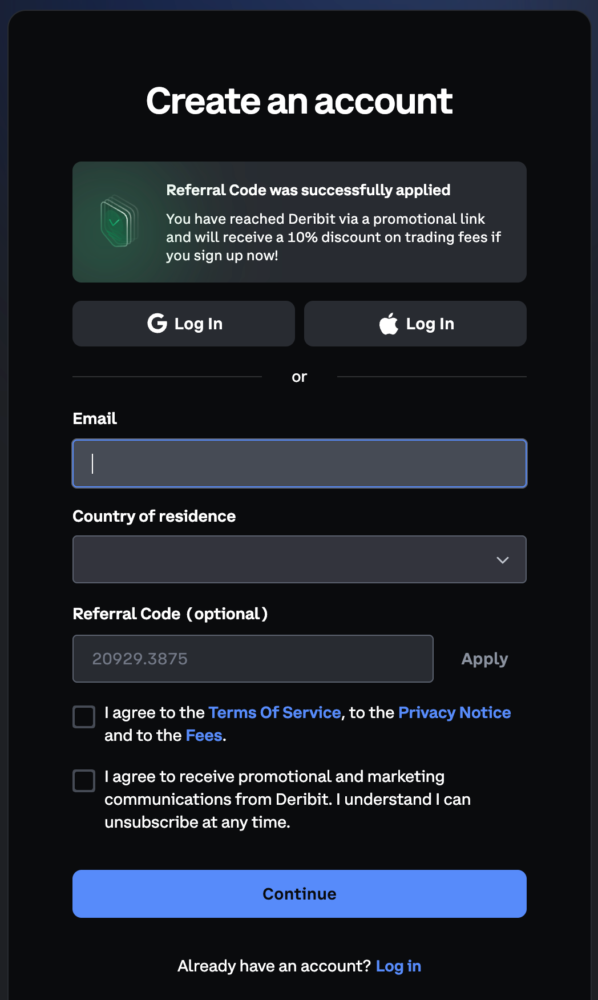
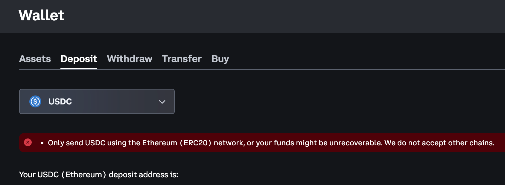
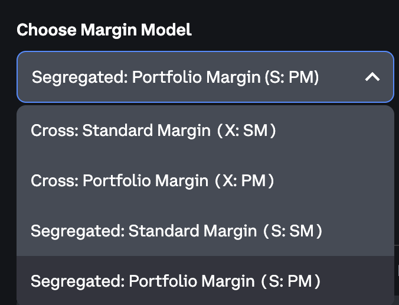
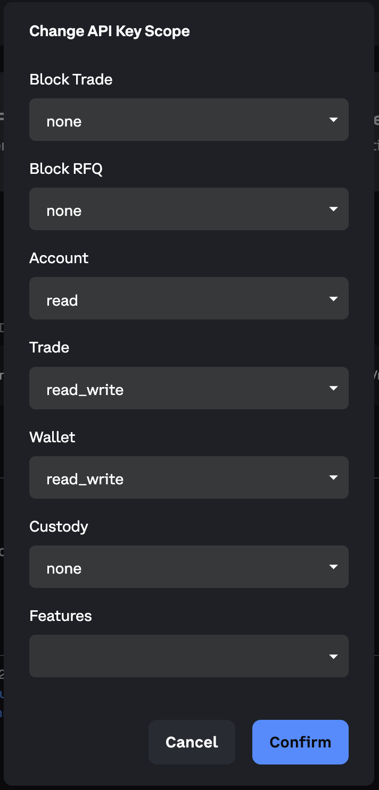
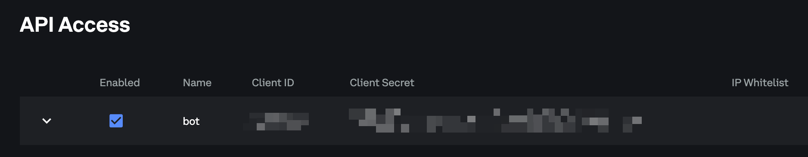
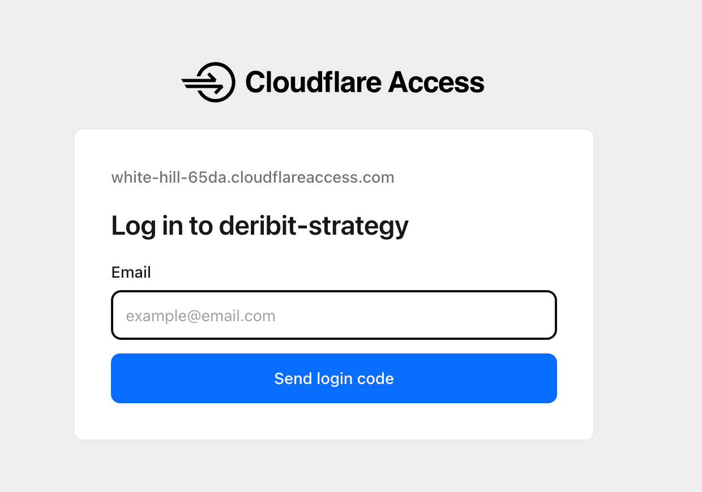

# 投資人前置作業指南

**Deribit 期權策略組合**｜版本 1.1

> 本文件說明投資人需自行完成的 Deribit 帳戶設定步驟。正式權利義務以雙方簽署之投資管理協議為準。Deribit 為獨立交易所；能否開戶、入金、交易期權，以你所在地與 Deribit 當下規定為準。本指南不構成投資建議。

---

## 開始前：先搞懂名詞

| 名詞 | 白話說明 |
|------|----------|
| **主帳戶** | 你註冊 Deribit 時的總帳戶。入金通常先到這裡；**季結算付費**也通常從這裡（或外部錢包）轉出。 |
| **策略子帳** | 主帳底下的分戶，**一個策略一個**（如 `naked`）。自動交易與季末**賣現貨兌穩定幣**只用這裡的 API。 |
| **API Key** | 給程式或管理方用的鑰匙。**僅在策略子帳**建立；**不要**提供主帳 API。 |

**建議順序：**

1. 註冊 Deribit 並完成身分驗證  
2. 入金到**主帳戶**（注意幣種與鏈，見第二節）  
3. 建立**策略子帳**，並將各帳保證金模式設為 **Segregated Portfolio Margin**  
4. 從主帳把資金劃到各**策略子帳**  
5. 在每個**策略子帳**建 API Key（**account:read + trade:read_write**；**wallet: none**）  
6. 提供**儀表板登入用 Email**（給 Cloudflare 白名單）  
7. 記下管理方**外部收款地址**（第六節；季結算付費用）  
8. 填寫**交接清單**（第八節）交給管理方  

---

## 一、註冊主帳戶與安全設定

### 1.1 註冊

1. 開啟註冊連結（已帶管理方推薦碼）：[https://www.deribit.com/?reg=20929.3875](https://www.deribit.com/?reg=20929.3875)。  
2. 點 **Register**／**Create account**，用 Email 註冊並設定強密碼。  
3. 到信箱點驗證連結，完成 Email 驗證。



### 1.2 身分驗證（KYC）

1. 登入後，依畫面提示完成 **Verify identity / KYC**（上傳證件、自拍等）。  
2. 審核通過前，可能無法入金或交易，請預留 **1～數個工作天**。  
3. 審核完成後，確認帳戶狀態為可交易（介面通常會顯示 Verified 或類似字樣）。

### 1.3 請務必開啟 2FA

1. 進入 **Account → Security**（或 **Profile → Security**）。  
2. 啟用 **Two-Factor Authentication（2FA）**，建議用 Google Authenticator 等 App。  
3. **保存好** 2FA 備用碼；遺失會很難登入。

**注意**

- 不要把登入密碼、2FA 備用碼交給任何人。  
- **不要**把「主帳戶」的 API Key 交給策略方；後面只在**子帳戶**裡建 Key。

---

## 二、入金（把資金轉進 Deribit）

資金會先進你的**主帳戶**。之後第三、四節才會把錢分到各**子帳戶**。

### 2.1 找到入金頁面

1. 登入 Deribit（確認右上角是**主帳戶**，不是某個子帳）。  
2. 點上方或側邊的 **Wallet**（錢包）。  
3. 選 **Deposit**（入金／充值）。



### 2.2 選擇幣種與網路（很重要）

入金時請依下表選擇**幣種**與**鏈（網路）**；外部錢包／交易所提現時必須與 Deribit 顯示**完全一致**。

| 幣種 | Deribit 入金請選的鏈／網路 |
|------|---------------------------|
| **BTC** | **Bitcoin（BTC）** 鏈 |
| **ETH** | **Ethereum mainnet**（以太坊主網） |
| **USDC** | **Ethereum mainnet**（以太坊主網，ERC-20） |

**請務必確認：**

| 注意事項 | 說明 |
|----------|------|
| 地址與網路要一致 | 選錯鏈可能無法到帳或資產遺失。 |
| 先小額測試 | 第一次建議先轉**小額**（例如 10～50 USDC），到帳後再轉大額。 |
| 保留手續費 | 從 Ethereum mainnet 提現時，帳上要留一點 **ETH** 當 Gas。 |

### 2.3 複製地址並從外部轉帳

1. 在 Deposit 頁**複製** Deribit 給你的入金地址（或掃 QR Code）。  
2. 打開你平常用的交易所或錢包（例如 Binance、OKX、硬體錢包）。  
3. 發起**提現／轉帳**：貼上剛複製的地址、選**同一條鏈**、輸入金額、確認。  
4. 回到 Deribit → Wallet，查看該幣種餘額是否增加。鏈上轉帳通常需數分鐘到數十分鐘。

### 2.4 各策略需要什麼幣？（供你入金參考）

實際金額以你與管理方簽約為準；入金時建議**多留一點緩衝**（保證金、手續費、行情波動）。

| 策略名稱（管理方會跟你說開哪幾個） | 子帳建議名稱 | 你需要準備的資產 |
|----------------------------------|--------------|------------------|
| 裸賣期權（Naked short） | `naked` | **僅 USDC**（劃到子帳後作保證金） |
| 牛市看跌價差（Bull put spread） | `bull_put` | **僅 USDC** |
| 備兌賣 Call（Covered call） | `covered_call` | **僅 BTC 或 ETH 現貨**作備兌與保證金（**不需**劃 USDC）；程式**不會**幫你買現貨 |

**注意**

- 入金完成後，錢還在**主帳**；第四節才要劃到**策略子帳**。

---

## 三、建立策略子帳

### 3.1 為什麼要開子帳？

- 不同策略**分開資金**，一個策略出狀況不會拖垮全部。  
- 每個子帳一把 **API Key**，程式只能動該子帳；**不會**拿到主帳 API，因此無法從主帳提幣。  
- 季結算時，管理方可在策略子帳用 **Trade** 將獲利**現貨**賣成 **USDC／USDT／USDE**（見第六節）；**不需**另開費用子帳，也**不需**把主帳 API 交給管理方。

### 3.2 建立步驟

1. 確認目前登入的是**主帳戶**（介面通常會顯示 Main account 或你的主帳名稱）。  
2. 打開 **Account** → **Subaccounts**（有些版本在 **Portfolio** 底下）。  
3. 點 **Create subaccount**（或 **Add subaccount**）。  
4. 依管理方給你的清單建立子帳，**名稱建議**如下（方便雙方對照）：

   | 用途 | 建議子帳名稱 |
   |------|--------------|
   | 備兌賣 Call | `covered_call` |
   | 裸賣期權 | `naked` |
   | 牛市看跌價差 | `bull_put` |

   若你只開其中一、兩個策略，只建對應子帳即可。

5. 建立完成後，畫面上應能看到子帳列表（餘額一開始通常是 0）。

**注意**

- Deribit 子帳名稱通常至少 **5 字元**（英數與底線）；上表名稱已符合。  
- 子帳名稱建立後往往**不能隨意改名**，請第一次就填對。  
- 還沒劃轉資金前，子帳餘額為 0 是正常的。

### 3.3 保證金模式：一律設為 Segregated Portfolio Margin

管理方策略以 **Segregated Portfolio Margin** 運作。請對**主帳戶**以及**每一個**策略子帳完成設定：

1. 切換到要設定的帳戶（主帳或某一子帳）。  
2. 點選 **My Account** → **Portfolio Margin**。  
3. 點 **Change Margin**。  
4. 選擇 **Segregated Portfolio Margin**，確認儲存。  
5. 對下一個帳戶重複上述步驟，直到主帳與所有子帳皆為 Segregated Portfolio Margin。



**注意**

- 若子帳仍為其他保證金模式，可能導致保證金計算與策略預期不符；啟用實單前請務必確認。  
- 不確定目前模式時，可在 **Portfolio Margin** 頁面查看，或截圖請管理方協助確認。

---

## 四、從主帳把資金劃到子帳

### 4.1 找到劃轉功能

1. 仍在 Deribit 後台，找到 **Transfer**（劃轉）或 **Internal transfer**。  
   常見路徑：**Wallet → Transfer**，或 **Subaccounts** 頁面裡的 **Transfer**。  
2. **From（來源）** 選：**Main account（主帳）**。  
3. **To（目標）** 選：某一個子帳，例如 `naked`。

### 4.2 依策略劃轉（重複直到分完）

對**每一個**要啟用的子帳各做一次：

1. 選幣種（**naked**／**bull_put**：USDC；**covered_call**：BTC 或 ETH 現貨，**不要**劃 USDC）。  
2. 輸入金額（依你與管理方約定的規模）。  
3. 確認劃轉。  
4. 切換到該**子帳**檢視餘額是否正確。

**切換子帳的方式（介面可能略有不同）：**

- 右上角帳戶選單 → 選擇子帳名稱；或  
- Subaccounts 列表 → 點 **Switch** / **Enter** 進入該子帳。

**注意**

- **劃轉是即時的**，在主帳與子帳之間，通常**沒有**鏈上手續費。  
- 劃錯子帳可以再用 Transfer 轉回主帳或轉到正確子帳（需你本人操作）。  
- **covered_call** 子帳：僅劃入約定數量的 **BTC／ETH 現貨**（現貨即保證金，**不需** USDC）。  
- **naked**、**bull_put**：請劃入 **USDC** 即可。

---

## 五、策略子帳的 API Key（每個策略子帳各一把）

### 5.0 季結算：為什麼要開 Trade？為什麼不開 Wallet？

管理費／績效費**不會**自動從策略子帳扣款。季結算後流程為：

1. **管理方**在策略子帳用 API **Trade** 將應計費用對應的**獲利現貨**（如 covered_call 的 BTC／ETH）**賣出**，兌成 **USDC、USDT 或 USDE**（穩定幣留在該策略子帳，供帳單對照）。  
2. **投資人**確認帳單後，從**主帳 Withdraw**（或自有外部錢包）將款項轉至管理方指定的**鏈上收款地址**（見第六節）。

Deribit **子帳之間**的 Internal transfer 需**主帳 API** 授權；管理方**不會**也**不應**取得主帳 API。因此策略子帳 API **不要**開啟 **Wallet**（設為 **none**）。

### 5.1 一定要先「進入」該策略子帳

API Key 綁在**當前所在帳戶**上：

1. 切換到策略子帳（例如 `naked`），確認**不是** Main account。  
2. 再建立 Key。

### 5.2 建立 API Key：畫面順序（請照這個做）

路徑：**Account → API** → **Add new key**（或 Create a new API key）。  
以下在**已切到策略子帳**的前提下操作（見 5.1）。

#### 步驟 A — 選金鑰類型（第一步，只做一次）

| 順序 | 畫面 | 你怎麼選 |
|------|------|----------|
| A1 | **Select key type** | 選 **Deribit-generated key**（由 Deribit 產生 Client ID / Secret） |
| A2 | Self-generated key | **不要選**（除非管理方明确要求） |

選 **Deribit-generated key** 並按繼續後，會出現 **Change API Key Scope** 視窗（見下圖）。

#### 步驟 B — 設定 **Change API Key Scope**（Deribit-generated key **之後**，由上到下）

預設多為 **none**。策略子帳請改成：

| 順序 | 畫面欄位 | 策略子帳請選 |
|------|----------|--------------|
| B1 | Block Trade | **none** |
| B2 | Block RFQ | **none** |
| B3 | Account | **read** ← 讀餘額／權益（bot 查詢、對帳靠這項） |
| B4 | Trade | **read_write** ← 期權下單／平倉；季末**賣現貨**兌 USDC／USDT／USDE |
| B5 | Wallet | **none** ← 不開；管理方無主帳 API，無法代你劃轉子帳 |
| B6 | Custody | **none** |
| B7 | Features | 留空／預設 |



**Name**、**IP Whitelist** 若 Deribit 在建立流程中另顯示：Name 可填 `naked-strategy`（可選）；IP 依管理方指示或留空。

#### 步驟 C — 建立並保存（最後）

| 順序 | 動作 |
|------|------|
| C1 | 在 **Change API Key Scope** 按 **Confirm**；若還有 Name／IP 等欄位，填完後按 **Create** |
| C2 | 複製 **Client ID**、**Client Secret**（Secret **只顯示一次**） |
| C3 | 安全交付管理方（見 5.3） |



### 5.3 交付給管理方（策略用）

每個**策略子帳**一組，透過安全管道交付：

```text
類型：策略子帳
子帳名稱：naked
環境：mainnet
API Key：________________
API Secret：________________
備註：Account=read、Trade=read_write、Wallet=none
```

每個策略子帳重複 5.1～5.3。

---

## 六、季結算付費與管理方外部收款地址

### 6.1 管理方在結算日會做什麼？

1. 出具帳單（USDC 等價，含管理費、績效費明細）。  
2. 若帳單對應的獲利部位含 **BTC／ETH 現貨**，管理方在**策略子帳**以 **Trade** 賣出並兌成 **USDC、USDT 或 USDE**（穩定幣留在子帳，方便你在 Deribit 後台與帳單對照）。  
3. 與你確認金額無誤。

### 6.2 投資人如何付費？

確認帳單後，請將應付金額轉至管理方指定的**外部鏈上地址**（**不是** Deribit 子帳之間的 Internal transfer）：

- 常見幣別：**USDC、USDT、USDE**（以帳單與管理方指示為準）。  
- **鏈／網路**必須與管理方提供的一致（多為 **Ethereum ERC-20**）；選錯鏈可能無法到帳。  
- 可從 Deribit **主帳 Withdraw** 提至該地址，或從你自有交易所／錢包直接轉帳。  
- 第一次建議**小額測試**，到帳後再轉帳單全額。

管理方收款地址由營運設定檔維護（`config/platform/fee-payout-addresses.toml`）。簽約或 onboarding 完成時，管理方會提供與下表相同內容的正式清單；以下為格式範例（**請以管理方交付的地址為準**）：

<!-- FEE_PAYOUT_ADDRESSES: managed in config/platform/fee-payout-addresses.toml -->

| 幣別 | 鏈／網路 | 地址 | 備註 |
|------|----------|------|------|
| USDC | Ethereum (ERC-20) | _（管理方提供）_ | 先小額測試 |
| USDT | Ethereum (ERC-20) | _（管理方提供）_ | 先小額測試 |
| USDE | Ethereum (ERC-20) | _（管理方提供）_ | 先小額測試 |

### 6.3 你應知道的事

- 管理方**不會**要求主帳 API Key，也**不會**代你從子帳劃轉至「費用子帳」。  
- 策略子帳內兌換後的穩定幣僅供**對帳參考**；實際付費以你轉至管理方**外部地址**的鏈上紀錄為準。  
- 詳見《投資人分潤與計費說明書》第五節。

---

## 七、儀表板登入用 Email（Zero Trust）

管理方會提供一個 **HTTPS 專屬網址** 讓你看持倉與績效摘要。為了只有你能開啟，需要你的 **Email** 加入白名單。

### 7.1 你需要提供

- 一個你**平常會用來收信、登入**的 Email，例如：  
  `your.name@gmail.com`  
- 若管理方說用 **Google 登入**，請提供該 Google 帳號的 Email。  
- 可事先告知管理方你慣用哪一種登入方式。

### 7.2 管理方設定好之後，你如何第一次登入

1. 用瀏覽器（建議 Chrome）開啟管理方給你的網址（例如 `https://你的名字.xxx.com/`）。  
2. 會先出現 **Cloudflare Access** 登入頁（不是你的 Deribit 密碼）。  
3. 輸入**已白名單的 Email**，或點 **Sign in with Google**。  
4. 通過後才會看到投資人績效頁（繁中頁路徑可能是 `/investor.zh.html`）。



**注意**

- **不要**把儀表板網址貼在公開場合；知道網址的人若未在白名單，理論上無法登入，但仍應保密。  
- 登入問題（收不到驗證信、Google 帳號不對）請聯絡管理方，不要自行改 Deribit 設定。

---

## 八、交接清單（填好交給管理方）

**建議**：向管理方索取 [`config/handoff/handoff.template.toml`](../config/handoff/handoff.template.toml)，填好後經**安全管道**交回（管理方執行 `./bot investor import-handoff`）。以下為同內容的文字版備用。

請複製以下內容填寫：

```text
【基本資料】
姓名／暱稱：________________
聯絡 Email：________________
Deribit 註冊 Email：________________

【儀表板】
用於登入白名單的 Email：________________
慣用登入方式：□ Email 驗證碼  □ Google

【環境】
正式環境 mainnet

【保證金模式】
□ 主帳與所有策略子帳均已設為 Segregated Portfolio Margin

【已建立的子帳與劃轉（USDC 策略填 USDC 等價約略即可）】
□ naked          子帳名稱：________  已劃轉 USDC：________
□ bull_put       子帳名稱：________  已劃轉 USDC：________

【covered_call 若啟用（僅現貨，無 USDC）】
子帳名稱：________
備兌 BTC 數量：________
備兌 ETH 數量：________

【API Key — 策略子帳】
□ 已透過安全管道交付（策略共 ____ 組）
□ 策略子帳已開 account:read + trade:read_write + wallet:none

【季結算付費】
□ 已收到管理方外部收款地址清單（USDC／USDT／USDE）

【其他】
備註：________________
```

---

## 九、請勿做的事（總整理）

| 請勿 | 原因 |
|------|------|
| 把主帳 API Key 交給管理方 | 風險範圍過大（含主帳提幣、子帳劃轉） |
| 策略子帳 API 開啟 Wallet | 外洩時可能被對外提幣；且管理方流程不需 Wallet |
| 策略子帳 API Key 外洩 | 含 Trade 權限，可能下單／賣現貨；僅透過安全管道交付 |
| 用聊天軟體明文傳 Secret | 容易被轉發或外洩 |
| 付費時選錯鏈或填錯管理方地址 | 可能無法到帳或資產遺失 |
| 入金選錯鏈或填錯地址 | 可能永久遺失 |
| 子帳保證金模式未設為 Segregated Portfolio Margin | 與策略保證金計算不一致 |
| 在 covered_call 子帳劃入 USDC 當保證金 | 此策略僅用 BTC／ETH 現貨作保證金 |
| 策略子帳尚未劃資就要求實單 | 無保證金可運作 |
| 把儀表板網址公開分享 | 應僅限本人與管理方知道 |

---

## 十、常見問題

**Q：主帳和子帳的錢可以互轉嗎？**  
A：可以。在 Deribit 用 **Transfer** 在主帳與子帳之間即時劃轉，通常不收鏈上費。

**Q：我只做一個策略，還需要子帳嗎？**  
A：管理方通常仍會要求至少一個子帳 + 一把 Key，以便權限隔離與對帳。

**Q：管理費／績效費怎麼付？**  
A：季結算後管理方開帳單；必要時在策略子帳**先 Trade 賣獲利現貨兌 USDC／USDT／USDE**。你確認金額後，轉至管理方**外部收款地址**（可從主帳 Withdraw 或外部錢包）。**不會**自動扣款，也**不需要**費用子帳。詳見《投資人分潤與計費說明書》。

**Q：為什麼不開 Wallet？**  
A：Deribit 子帳互轉需主帳 API；管理方不持有主帳金鑰。付費改為鏈上轉至管理方地址。

**Q：下拉選單只有 none / read / read_write 怎麼選？**  
A：策略子帳：**Account = read**、**Trade = read_write**、**Wallet = none**；其餘 none。

**Q：一定要先選 Deribit-generated key 嗎？**  
A：是。先選金鑰類型，**之後**才會出現 **Change API Key Scope** 視窗。

**Q：程式會幫我從交易所提幣到銀行嗎？**  
A：不會。管理方無主帳 API；季末付費由你自行鏈上轉帳至管理方指定地址。

**Q：保證金模式要怎麼設？**  
A：主帳與所有子帳請一律設為 **Segregated Portfolio Margin**：**My Account** → **Portfolio Margin** → **Change Margin** → 選 **Segregated Portfolio Margin**。

**Q：covered_call 子帳需要 USDC 嗎？**  
A：**不需要。** 僅劃入約定數量的 **BTC 或 ETH 現貨**即可；現貨同時作備兌與保證金。

---

**產生 PDF**（在專案根目錄執行；使用 reportlab，不需 Pandoc／LaTeX）：

```bash
python3 scripts/generate_investor_onboarding_pdf.py
```

輸出檔：`output/pdf/Investor_Onboarding_zh-TW.pdf`
