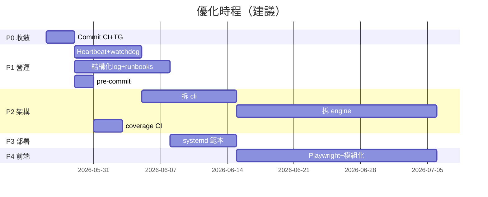

# 專案優化計畫

本文件整理 Deribit Options Strategy Engine 的現況、已完成項、以及建議的分階段優化路線。  
適用對象：管理方 / 維護者；與 [`repo-layout-zh-TW.md`](repo-layout-zh-TW.md)、[`operator-onboarding-zh-TW.md`](operator-onboarding-zh-TW.md) 互補。

最後更新：2026-05-26

---

## 1. 現況快照

### 1.1 已具備（baseline）

| 領域 | 現況 |
|------|------|
| **策略引擎** | `naked_short` / `bull_put_spread` / `covered_call`；dry-run 預設 |
| **多投資人** | `config/investors/<id>/` + `accounts.toml`；執行期資料完全隔離 |
| **Ops 與策略分離** | `config/platform/registry.toml`（埠、hostname）vs `accounts.toml`（策略 manifest） |
| **投資人 onboarding** | `docs/investor-onboarding-zh-TW.md`、handoff、`import-handoff` |
| **管理方 runbook** | `docs/operator-onboarding-zh-TW.md` |
| **費用與合規** | HWM/NAV 快照、季結算、PDF/MD/CSV、fee 專戶、披露文件 |
| **常駐（macOS）** | launchd + `./bot investor live\|frontend start` |
| **Dashboard** | bundle API、多帳並行聚合、stress prefetch 重用 |
| **API 穩定性** | `exchange_throttle.py` 全进程 pacing |
| **測試** | 25+ 測試檔、~275 test cases |
| **目錄規範** | `docs/repo-layout-zh-TW.md`（canonical vs legacy） |

### 1.2 本機已做、待收斂進 main

| 項目 | 說明 |
|------|------|
| **GitHub Actions CI** | `.github/workflows/ci.yml` — pytest（3.11/3.12）+ Ruff |
| **pyproject.toml** | 專案 metadata、pytest / Ruff 設定 |
| **requirements-dev.txt** | pytest、ruff 與 runtime 分離 |
| **CHANGELOG.md** | 版本變更紀錄初版 |
| **Telegram 告警** | `deribit_demo/telegram_alerts.py`、`./bot telegram-test` |
| **live_enabled** | `accounts.toml` 可 dashboard 追蹤但不 auto-live |
| **Ruff format** | 全 repo 格式統一（待 commit） |

### 1.3 仍缺 / 技術債

| 項目 | 風險 |
|------|------|
| 大量改動未 commit / push | main 與本機漂移 |
| `engine.py` ~5,900 行 | 改策略易牽連全局 |
| `cli.py` ~1,300 行、`frontend_server.py` ~2,800 行 | 同左 |
| `frontend/app.js` ~4,600 行、零 build | 難 modularize |
| 無 pre-commit、CI 無 coverage | 品質門檻不完整 |
| 無 heartbeat / 外部 watchdog | bot 卡住可能無人知 |
| 無結構化 log | 事後追查困難 |
| 無 `docs/runbooks/`（incident） | 3am 無照表操課 |
| 無 systemd 範本 | Linux VPS 需從頭摸索 |
| `telegram.env.example` 與 `defaults.env` 重複 | 設定路徑易混淆 |

---

## 2. 設定檔說明（Telegram / defaults）

**Runtime 只載入一個共用檔**（全投資人）：

```text
config/shared/defaults.env   # 或 .env.defaults（gitignore）
```

載入順序見 `env_layout.py`：`defaults.env` → 投資人 env → 策略 profile → 子帳 env。

- **`defaults.env.example`**：共用參數範本（可 commit）
- **`telegram.env.example`**：僅說明用片段，**不會**被 bot 自動讀取 → 計畫刪除，改由本文 + [`telegram-alerts-zh-TW.md`](telegram-alerts-zh-TW.md) 說明

Telegram 金鑰應寫在 **`defaults.env`**（勿 commit；已在 `.gitignore`）：

```dotenv
TELEGRAM_ALERTS_ENABLED=true
TELEGRAM_BOT_TOKEN=
TELEGRAM_CHAT_ID=
TELEGRAM_ALERT_COOLDOWN_SECONDS=300
```

---

## 3. 分階段計畫

### Phase 0 — 收斂本機改動（1–2 天）

**目標**：工程基礎落地，main 與本機一致。

| # | 任務 | 產出 / 完成標準 |
|---|------|-----------------|
| 0.1 | Commit + push CI、pyproject、Telegram、Ruff、CHANGELOG | GitHub Actions 綠燈 |
| 0.2 | 確認 `defaults.env` 內 Telegram 已啟用且 `./bot telegram-test` 成功 | 告警通道可用 |
| 0.3 | 刪除 `telegram.env.example`，更新 README / docs 指向單一 `defaults.env` | 設定路徑單一 |
| 0.4 | Commit `live_enabled` 及對應 tests（若已驗證） | 子帳可「只追蹤不下單」 |

---

### Phase 1 — 營運可靠性（1–2 週）

**目標**：多位投資人 live 時，無人盯螢幕也能發現故障。

| # | 任務 | 說明 | 位置 / 工具 |
|---|------|------|-------------|
| 1.1 | **Heartbeat 檔** | 每 live cycle 寫入 timestamp、regime、last_error | `engine.run()` → `.state/investors/<id>/<slug>.heartbeat.json` |
| 1.2 | **外部 watchdog** | cron / launchd 檢查 heartbeat 過期 → Telegram | `scripts/check_live_heartbeat.py` |
| 1.3 | **結構化 log** | JSON 欄位：`investor_id`、`slug`、`cycle`、`regime` | live 路徑 logging handler |
| 1.4 | **Incident runbooks** | state 不一致、panic、429、Tunnel 失效、憑證輪替 | `docs/runbooks/*.md` |
| 1.5 | **pre-commit** | commit 前 ruff + 快取 pytest | `.pre-commit-config.yaml` |

**完成標準**：bot 停 ≥10 分鐘內收到 TG；runbook 可照表處理常見故障。

**現階段不做**：Sentry / Datadog（等 TG + heartbeat 穩定後再加）。

**Telegram 已覆蓋事件**（見 [`telegram-alerts-zh-TW.md`](telegram-alerts-zh-TW.md)）：

- Hard derisk、hard/soft stop 平倉、panic close  
- Run loop crash、API 連續失敗（≥5 次）  
- `run_live_profiles.py` 子程序 exit / restart  

---

### Phase 2 — 程式架構（2–4 週，可與 Phase 1 並行）

**目標**：降低巨型模組風險；新功能好加、好測。

| # | 任務 | 拆分方向 | 理由 |
|---|------|----------|------|
| 2.1 | **`cli.py` → `cli/`** | `investor.py`、`fee.py`、`strategy.py`、`frontend.py` | ~1,300 行 |
| 2.2 | **`engine.py` → `engine/`** | `scanner`、`entry`、`management`、`execution` | ~5,900 行，最高優先 |
| 2.3 | **`frontend_server.py`** | `routes/bundle`、`groups`、`stress` | dashboard 持續擴張 |
| 2.4 | **CI coverage** | 門檻先 60% → 70% | `pytest --cov` in Actions |

**原則**：每 PR 只拆一塊 + tests 全綠，避免 big-bang refactor。

**完成標準**：`engine/` 各檔 < ~1,500 行；CI 產出 coverage 報告。

---

### Phase 3 — 部署與跨平台（1–2 週）

**目標**：macOS launchd 已有；補 Linux / 備援。

| # | 任務 | 產出 |
|---|------|------|
| 3.1 | **systemd unit 範本** | 對標 `config/launchd/com.deribit.live.plist.template` |
| 3.2 | **Docker Compose（可選）** | 固定 Python、bot + frontend 一鍵起 |
| 3.3 | **Uptime 監控** | 各 investor frontend port + Cloudflare Tunnel | Uptime Kuma 或 curl cron |

**完成標準**：macOS 用 launchd、Linux 有對等 systemd 文件可照做。

---

### Phase 4 — 前端與對外交付（2–4 週，可延後）

| # | 任務 | 說明 |
|---|------|------|
| 4.1 | **`app.js` 模組化** | Vite + ES modules（不必一次上 React） |
| 4.2 | **Playwright 煙霧測試** | dashboard 載入、`GET /api/dashboard_bundle` → 200 |
| 4.3 | **Cloudflare Access checklist** | registry 已有 `dashboard_email`；補 policy 文件 |

---

### Phase 5 — 規模化（第 4–5 位投資人或多機時）

| # | 任務 | 觸發條件 |
|---|------|----------|
| 5.1 | PostgreSQL 取代部分 SQLite ledger | 多機寫入、長期報表 |
| 5.2 | Metabase 投資人報表 | 非工程師查 PnL |
| 5.3 | Sentry + Loki | 需 stack trace / 集中 log |
| 5.4 | 套件 rename（`deribit_demo` → 正式名）+ git tag | 對外版本化 |

---

## 4. 建議時程（約 12 週）



---

## 5. 優先級速查

| 優先 | 做什麼 | 為什麼 |
|------|--------|--------|
| **P0** | Commit CI + Telegram + 收斂 env 文件 | 立刻有 regression 保護 |
| **P1** | Heartbeat + watchdog + runbooks + pre-commit | live 最痛點 |
| **P2** | 拆 `engine.py` / `cli.py` + coverage | 長期維護成本 |
| **P3** | systemd / Docker | 上 VPS 才急 |
| **P4** | 前端 Vite / Playwright | 對外 dashboard 穩定後 |
| **P5** | PG / Metabase / Sentry | 投資人與機器數再上一級 |

---

## 6. 刻意不做（現階段）

| 項目 | 原因 |
|------|------|
| Kubernetes | 3 投資人 × launchd 足夠 |
| 全面 TypeScript rewrite | 成本高、收益晚 |
| Kafka / 事件流 | 無多 consumer 需求 |
| 加大量新策略功能 | 先穩營運與架構 |

---

## 7. 業界工具對照（按需採用）

| 需求 | 建議工具 | 對應 Phase |
|------|----------|------------|
| CI / lint | GitHub Actions、Ruff、pre-commit | 0、1 |
| 告警 | Telegram（已有）、heartbeat script | 1 |
| 監控 | Uptime Kuma、Grafana（後期） | 3、5 |
| 例外追蹤 | Sentry | 5 |
| 日誌 | 結構化 JSON → Loki | 1、5 |
| 報表 | Metabase | 5 |
| 部署 | launchd（已有）、systemd、Docker Compose | 3 |

---

## 8. 相關文件

| 文件 | 用途 |
|------|------|
| [`README.md`](../README.md) | Quick start、常用指令 |
| [`repo-layout-zh-TW.md`](repo-layout-zh-TW.md) | 目錄與 legacy 遷移 |
| [`operator-onboarding-zh-TW.md`](operator-onboarding-zh-TW.md) | 新增投資人 |
| [`live-profiles-launchd-zh-TW.md`](live-profiles-launchd-zh-TW.md) | Live bot 常駐 |
| [`telegram-alerts-zh-TW.md`](telegram-alerts-zh-TW.md) | Telegram 設定 |
| [`CHANGELOG.md`](../CHANGELOG.md) | 版本變更 |

---

## 9. 下一步（擇一開工）

1. **Phase 0**：commit CI + Telegram + 刪除冗餘 `telegram.env.example`  
2. **Phase 1.1–1.2**：heartbeat + `scripts/check_live_heartbeat.py`  
3. **Phase 2.1**：拆分 `cli.py`  

完成 Phase 0 後，建議在 README「文件」一節加入本計畫連結。
