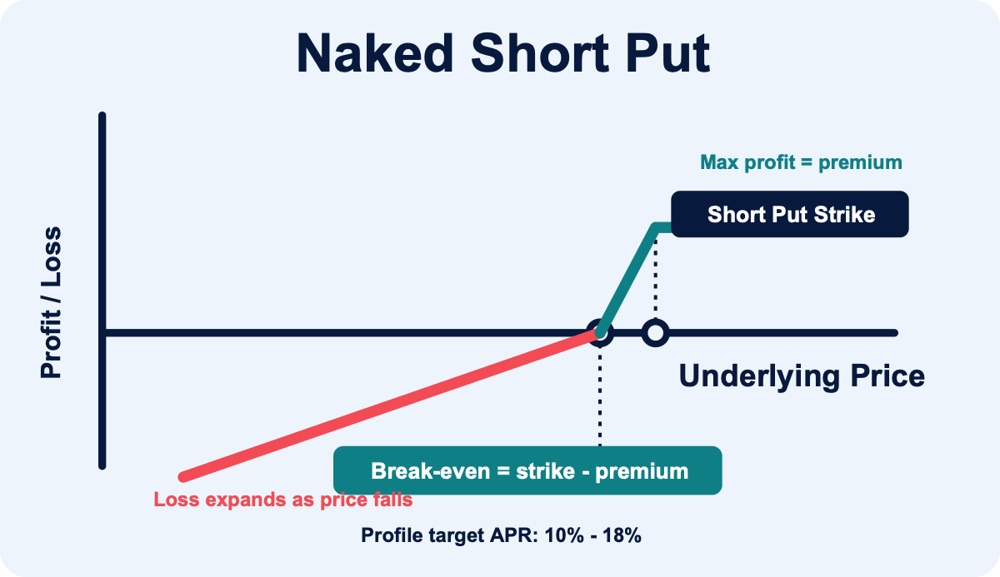
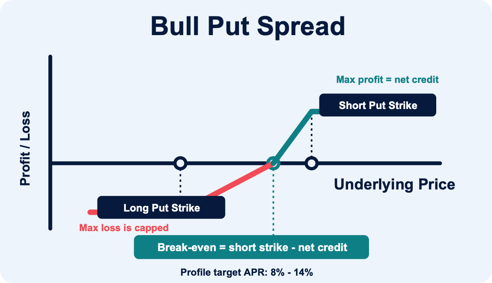
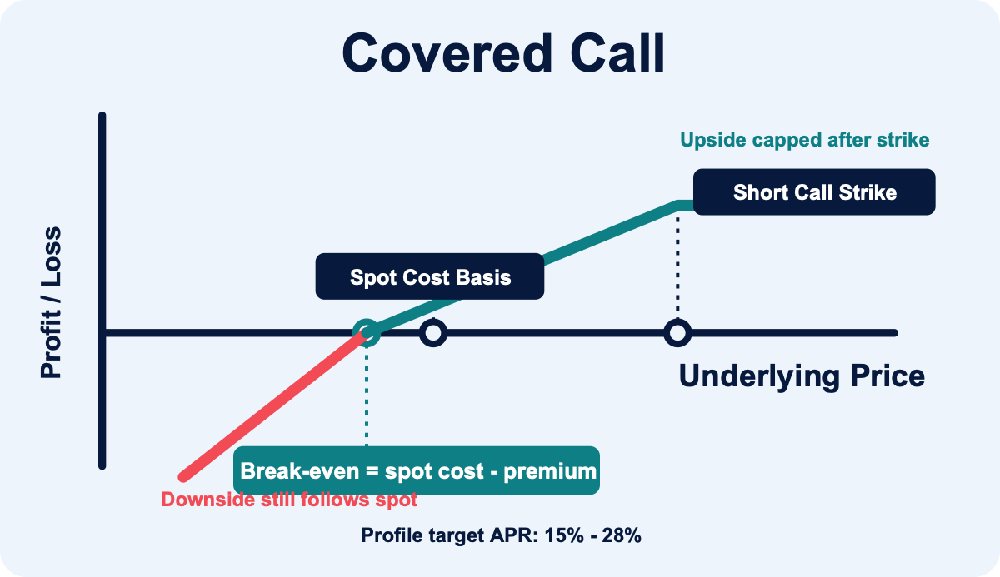

# 策略模型

## 核心設計

- `naked_short`：單腿 short option，骨架預設 `SHORT_OPTION_SIDE=put`（可改 `call` / `both`）；選約以 delta 為主、OTM 僅地板（無 max）。舊名 `naked_short_put` / `naked_short_call` 會自動正規化成 `naked_short`
- `bull_put_spread`：先買 long put 保護腿，再賣 short put，最大虧損以 spread width 封頂
- `covered_call`：只在既有 BTC/ETH 庫存足夠時賣 call，不自動買底層，也不使用 perp 作 cover；可選擇在 ITM 退場時同步賣 Deribit spot
- 可選擇是否啟用 `perp` delta hedge
- `spot` 不參與正常收益流程，只留給異常庫存處理
- 目標是 `1000 USDC` 參考資金下年化淨利 `200 USDC+`
- 預設 `dry-run first`，只有 `--live` 才會真的下單

## 掃描與風控

- 掃描 `Deribit Linear USDC Options` 與 `BTC/ETH-settled reversed options`
- 進場 DTE 由策略 **tier profile** 的 `PUT_DTE_MIN` / `PUT_DTE_MAX` 決定（covered call 多為 **7–35 天**；naked short **10–35 天**；bull put spread low tier 為 **12–21 天**）。`.env.example` 的 10–21 僅作 legacy 單檔 fallback
- short leg 會先過 delta、OTM、OI、book notional、spread ratio、APR 與 book IM/MM 門檻
- `bull_put_spread` 的 long put 以 `BULL_PUT_LONG_DELTA_MIN/MAX` 選擇，同到期且 strike 低於 short put
- `covered_call` 只使用 BTC/ETH 本位 book 的既有可用庫存作 cover，不會自動買現貨或用 perp 補 cover；tier profile 預設 **`COVERED_CALL_SPOT_EXIT_ENABLED=true`**（ITM 結算後賣 Deribit spot）
- 投資人 layout 下 **IV Rank 進場閘門**預設開啟（`config/shared/.env.defaults`）；`covered_call` 與 `naked_short` 策略骨架另覆寫為較寬鬆（BTC/ETH `MIN_IV_RANK=0.05`，`MIN_IV_MINUS_RV=0`），品質交由 delta／APR
- 只做流動性足夠的 short leg：`OI`、`book notional`、`spread ratio` 都要過門檻
- `MIN_LIQUID_EXPIRIES_REQUIRED` 可控制 DTE 視窗內至少需要幾個可交易 expiry 才允許開倉
- regime 分為 `normal / elevated / crisis`
- `crisis` 不開新倉；`elevated` 也不開新倉（含 24h 指數回撤與 DVOL 放大）。`naked_short`（short put）另外：連續兩個交易日各自下跌 ≥ `NAKED_ENTRY_DOWN_DAY_PCT`（骨架預設 1.5%）時升為 `elevated`，避免跌勢還沒打到 24h 門檻就繼續賣 put。`hard stop` 直接平倉；`soft trigger` 優先 roll，不行就平倉；`TP` 與 `time exit` 都會主動退場。naked short 防守需連續 **2** 個 manage cycle 確認（`DEFENSE_CONFIRM_CYCLES=2`）。

## 策略比較

### `naked_short`

單腿賣 OTM option，依 `SHORT_OPTION_SIDE` 控制方向（骨架預設 **`put`**）：

- `put`：只掃 short put（等同舊版 `naked_short_put`），下跌尾端風險最大。
- `call`：只掃 short call，上漲尾端風險最大。
- `both`：put 與 call 候選合併競爭 `TOP_N`；engine 不強制保留 call 名額。

選約以 **delta 為硬門檻與排序主軸**（優先於 TARGET APR）；`*_PUT_OTM_MIN` 僅作安全地板（**無 OTM max**），同 delta 下偏好更深 OTM。骨架 IV 閘門較寬鬆，薄權利金仍由 `MIN_NET_APR` 過濾。連續下跌時先停開新倉（見上方 regime）。

### `bull_put_spread`

賣較高 strike put，同時買較低 strike put 作保護腿，最大虧損約為 spread width 減淨權利金。因為虧損被 long put 封頂，short put delta 可比 naked short 稍高，但淨權利金、long leg 流動性與 max-loss APR 要一起檢查。

### `covered_call`

只用既有 BTC/ETH 現貨庫存賣 call；現貨 cover 會降低 upside short call 的爆倉型風險。選約以**保留現貨**為原則：**delta 為硬門檻與排序主軸**（優先於 TARGET APR），`CALL_OTM_MIN` 僅作安全地板（依 tier：low 較高、high 較低），**不設 OTM max**；同 delta 下偏好更深 OTM。風險是上漲收益被履約價封頂，以及 ITM 結算後仍可能留下 spot exposure。Low 的進場 spread 上限為 **18%**（`INVERSE_MAX_SPREAD_RATIO=0.18`；medium／high 仍 15%）：上漲週期只放寬 bid-ask，**不放寬 OTM／delta**，以免把 LOW 做成更近 strike。

**獲利／退場口徑（幣本位）**：BTC/ETH 本位 covered call 的 take-profit、time-exit、`profit_capture` 以**權利金幣數**（進場均價 × 數量 − 進場 fee）對比買回成本衡量，**不**因標的指數上漲把同一 ETH/BTC premium 換算成更高 USDC 而誤判未達門檻。USDC linear 部位仍走 USDC 口徑。

**ITM 退場（預設 tier 設定）**：

- **Settlement spot exit**（`COVERED_CALL_SPOT_EXIT_ENABLED=true`）：僅在 short call **到期** ITM 結算後才標記 pending；下一輪 `manage` market 賣 **BTC_USDT / ETH_USDT**，數量為 **`cover − settlement_loss`**（僅 cover；權利金走 Profit swap）。該幣別 **SPOT SELL 尚未賣完**（pending／partial）時不會再開新 covered call，待賣量也不計入 available cover。到期前的 income exit（TP / time / early）或外部買回**不會**賣 cover（可另做 profit sweep）。若開啟 `COVERED_CALL_PROFIT_SWEEP_ENABLED`，ITM exit 完成後會另排程權利金 sweep。settlement 優先 Deribit transaction log，否則 intrinsic 估算。
- **ITM → cash-secured put**（`COVERED_CALL_ITM_TO_CASH_SECURED_ENABLED=false` 預設關閉）：ITM spot exit **賣成 USDC** 後，同一 covered_call 子帳賣短天期 USDC linear put，履約價貼近原 call 行權價。手續費／結算／進位若讓 USDC 剛好不夠鎖滿 cover，會在設定窗內往下抓 strike。開啟後舊的 USDT 賣出也當已換成 USDC 來掃 CSP；該 group 不再自動買回 cover。進場 **IOC 打 bid**（不成交下個 cycle 重試，不掛 GTC mid）。預覽挑選：`./bot --account covered_call scan --cash-secured [--from-group 0095]`（不下單；已開倉也可看排名）。OI／名目仍過 CSP 門檻。先前取消 mid 掛單的 `operator_cancelled` 會再掃一次。CSP **持有至到期**（不做 TP／time exit）。到期 **ITM** 後用剩餘 USDC 掛 mid 買 `BTC_USDC` / `ETH_USDC` 補回 cover；OTM 到期只留現金、不買現貨。
- **自動買回 cover**（`COVERED_CALL_AUTO_SPOT_RESTORE_ENABLED=false` 預設關閉）：ITM spot exit **賣完**後，live `manage` 立刻掛 **GTC 限價**於買回上限（損益兩平 × `(1 − MIN_EDGE_PCT)`，預設 0.1%），數量為 native unrestored（進位到 **USDC linear 最小下單量**，BTC `0.01` / ETH `0.1`，不超過 cover）。成交前只對帳，**不再下市價單**。你在交易所或後台**取消未成交買單**後會記 `operator_cancelled`，**不會自動重掛**。`spot_exit_status=skipped`（例如手動提領）不會掛。手動仍可用 `./bot spot-restore`。已改走 cash-secured（USDC）的 group 不會掛買回。
- **Robust exit**（`COVERED_CALL_ROBUST_EXIT_ENABLED=false` 為 tier 預設）：接近到期且 ITM 時**先買回** short call，再賣 spot cover（不扣 settlement；premium 已用於買回）。可設 `COVERED_CALL_ITM_CONFIRM_CYCLES` 避免 wick 假觸發。

預設啟用 **槽位分配**（`COVERED_CALL_SLOT_SIZING=true`）：依合約最小單位（BTC 通常 0.1）把可填 cover 整數均分到剩餘 `MAX_GROUPS_PER_CURRENCY` 槽位（`ceil(units / slots)`），避免 `cover ÷ 槽位數` 再 floor 後留下無法再開的碎量。例如 0.5 BTC、3 槽、min 0.1 → 依序約 **0.2 / 0.2 / 0.1**（仍受盤口 `best_bid_amount` 上限）。

## Payoff 示意

下列圖表是單位化 payoff 示意，用來快速比較到期價格與收益形狀；實際收益仍以 `scan` / `enter-best` 的成交 credit、debit、fee、slippage 與持倉天數為準。

**`naked_short`（短 put 範例）**：假設 short put strike `K=100`、收到權利金 `P=2`。價格高於 `K` 時收益封頂為權利金，跌破損益兩平點後虧損跟著標的下跌擴大。short call 形狀對稱，只是價格上漲超過 `K` 後虧損擴大。

**`bull_put_spread`**：假設 short put `K=100`、long put `L=90`、淨 credit `P=2`。上方收益同樣封頂，但下跌最大虧損被 long put 限制。

**`covered_call`**：假設持有現貨成本 `S0=100`、short call strike `K=110`、收到權利金 `P=2`。權利金提供一點下跌緩衝，但上漲超過 `K` 後總收益被封頂。

## 策略參數

各策略骨架位於 [`config/shared/strategies/`](../config/shared/strategies/)；delta / APR / IM 等 tier 參數在 [`config/shared/strategies/tiers/`](../config/shared/strategies/tiers/)。投資人視角對照見 [風險分級與 APR 說明](investor-risk-tiers-apr-zh-TW.md)；載入順序見 [設定與環境變數](configuration-zh-TW.md#策略-profile-與-tier)。
